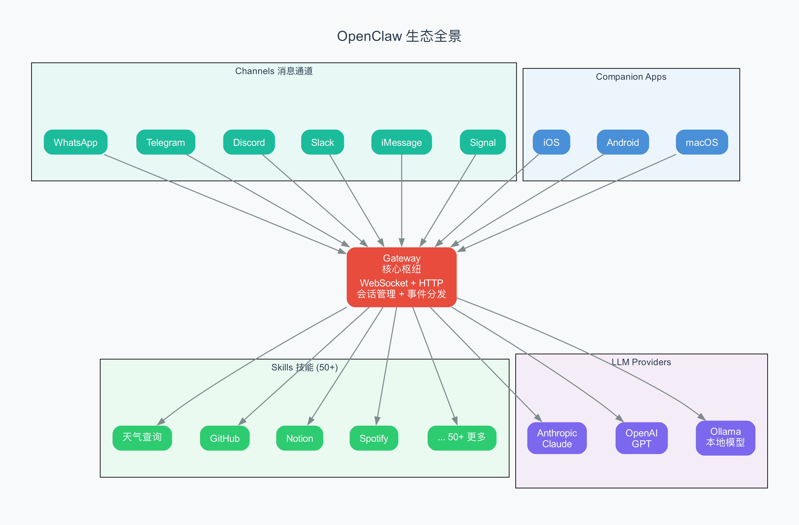

# 第 1 章 OpenClaw 是什么

> 一只太空龙虾，如何在 60 天内打败了 React 十年的记录。

## 1.1 你有没有想过这样一个问题

想象一下这个场景：

早上 7 点，你还在睡觉。你的 AI 助手已经自动醒了——它检查了你的日历，发现今天下午 2 点有一个重要的会议；它查看了邮箱，整理了 3 封需要你回复的邮件；它甚至还帮你订好了午餐，因为昨天你随口说过一句"明天想吃日料"。

等你在 8 点醒来，打开 WhatsApp，看到的是一条条已经帮你安排好的消息。你只需要说一句"好的"，一天的事情就已经步入正轨了。

这不是科幻电影。这是 **OpenClaw** 正在做的事情。

## 1.2 从 "前景 Agent" 到 "始终在线"

要理解 OpenClaw 为什么这么火，得先说说现有的 AI 工具有什么局限。

你可能用过 Claude Code、ChatGPT 或者 Cursor。这些工具有一个共同点：**你必须坐在电脑前，打字给它，它才干活**。你不说话，它就停在那里，一动不动。

用技术的说法，这些叫"前景 Agent"（foreground agent，即需要人在前面操作才能运行的智能程序）——你打字，它响应，你们一来一回地迭代。就像一个厨师，你说"炒个蛋炒饭"，他就炒一盘端上来。你不点菜，他就站在厨房里等。



但 OpenClaw 不一样。它是一个 **"始终在线"（always-on）** 的 AI 助手。你不说话，它也在干活。它像一个真正的管家——不需要你时时刻刻下指令，它会自己看日历、查邮件、管日程、甚至帮你订外卖。

用一句话概括这个区别：

> **Claude Code 是"你说什么我做什么"，OpenClaw 是"你不说我也在做"。**

这个从"前景工具"到"始终在线助手"的跨越，就是 OpenClaw 爆火的本质原因。

## 1.3 一只龙虾的故事

OpenClaw 的故事，要从一个人说起。

**Peter Steinberger**，一位奥地利的程序员。他在 2011 年创办了一家做 PDF 技术的公司 PSPDFKit，干了 13 年，几乎每个周末都在加班。2021 年，公司拿到了约 1 亿欧元的投资（据传最终出售价格高达 8 亿美元）。之后，Peter 经历了一段"退休"期，实际上是一种职业倦怠（burnout，即因长期高压工作导致的身心疲惫状态）。

在这段低谷期，他开始疯狂探索 AI。据说他先后做了 **43 个失败的 AI 项目**，直到第 44 个——OpenClaw——一炮打响。

### 三次改名

| 时间 | 名字 | 原因 |
|------|------|------|
| 2025 年 11 月 | **Clawdbot** | 最初的名字，"Clawd"是 Claude + claw（龙虾钳）的双关 |
| 2026 年 1 月 27 日 | **Moltbot** | Anthropic 说"Clawd"听起来太像 Claude，要求改名。"Molt"是龙虾蜕壳的意思 |
| 2026 年 1 月 30 日 | **OpenClaw** | Peter 觉得 Moltbot "怎么念都不顺口"，三天后再次改名 |

项目的吉祥物是一只名叫 Molty 的"太空龙虾"（Space Lobster），这个形象在 AI 社区中广为人知。

### 爆炸式增长

OpenClaw 的增长速度是 GitHub 历史上前所未有的：

| 里程碑 | 日期 | 备注 |
|--------|------|------|
| 项目发布 | 2025 年 11 月 | MIT 协议开源 |
| 60,000 星 | 2026 年 1 月 30 日 | 病毒式传播后 72 小时内达成 |
| 100,000 星 | 2026 年 2 月 1 日 | 峰值增速：**每小时 710 星** |
| 250,000+ 星 | 2026 年 3 月 | 超越 React，成为 GitHub 星标最多的软件项目 |
| 335,000+ 星 | 2026 年 3 月底 | GitHub 全球排名第 7 |

一个关键对比：**React 积累 24.3 万星花了 10 年，OpenClaw 用了 60 天就超越了它。**

### Peter 加入 OpenAI

2026 年 2 月 14 日，Peter 宣布加入 OpenAI。他在博客中写道：

> "I'm a builder at heart. I did the whole creating-a-company game already, poured 13 years of my life into it... What I want is to change the world, not build a large company."
>
> （我骨子里是个建造者。我已经玩过创建公司的游戏了，倾注了 13 年……我想改变世界，而不是建一家大公司。）

OpenClaw 项目则移交给了一个独立的开源基金会继续运营。

## 1.4 OpenClaw 到底是什么

说了这么多故事，让我们回到技术本身。

**OpenClaw 是一个开源的个人 AI 助手平台。** 它运行在你自己的设备上（Mac mini、Linux 服务器、树莓派都行），通过你日常使用的消息应用和你交流。

核心特点：

**多通道（Multi-channel）**：支持 20+ 个消息平台——WhatsApp、Telegram、Discord、Slack、iMessage、Signal、微信、IRC、Microsoft Teams、Google Chat、Matrix、飞书、LINE 等等。你用哪个聊天软件，它就在哪个软件里回答你。

**始终在线（Always-on）**：它是一个持续运行的后台服务（Gateway，即网关，系统的心脏，负责接收和分发所有消息）。你不找它，它也可以通过定时任务（cron，即按照时间表自动执行的任务）、Webhook（即外部系统推送过来的通知）、心跳检查（heartbeat，即定期自动触发的检查机制）等方式自主运行。

**持久记忆（Persistent Memory）**：它不会"失忆"。通过将重要信息写入本地 Markdown 文件，下次对话时能记住你之前说过的事情。这和 ChatGPT 那种"关掉窗口就忘光"的体验完全不同。

**可扩展（Extensible）**：内置 50+ 个 Skill（技能，即 AI 可以调用的工具包），覆盖天气查询、GitHub 操作、Notion 笔记、Spotify 播放、邮件管理等方方面面。通过 ClawHub（技能市场），还能自动发现和安装新的 Skill。

**自托管（Self-hosted）**：所有数据都存在你自己的设备上，不需要把私人信息交给任何云服务。你的聊天记录、日程安排、邮件内容——全都只有你自己能看到。

## 1.5 和 Claude Code 的本质区别

你可能已经读过本系列关于 Claude Code 的教程。那 OpenClaw 和 Claude Code 有什么区别呢？

| 维度 | OpenClaw | Claude Code |
|------|----------|-------------|
| **定位** | 个人 AI 助手 | 编程 AI 工具 |
| **交互方式** | 消息平台（WhatsApp/Telegram 等） | 命令行终端 |
| **是否自主** | 可以定时/事件触发自主运行 | 必须人工输入 |
| **持久记忆** | 有——本地 Markdown 持久化 | 无（仅会话内） |
| **编程语言** | TypeScript（约 43 万行） | Rust |
| **最佳场景** | 全天候个人助理 | 迭代式本地开发 |

用比喻来说：

- **Claude Code** 是一个技术精湛的厨师——你点菜，他炒菜，炒完端上来等你点评，然后做下一道。
- **OpenClaw** 是一个全能的管家——你出门了，他还在家里帮你收快递、接电话、打扫卫生、准备晚餐。等你回来，一切都安排好了。

它们不是竞争关系，而是互补关系。Claude Code 擅长"深度执行"——和你一起改代码、调试、重构。OpenClaw 擅长"广度覆盖"——同时管着你的邮件、日历、社交、天气、音乐等方方面面。

## 1.6 OpenClaw 的架构长什么样

从高处俯瞰，OpenClaw 的架构分为四层：

```
Companion Apps（伴侣应用）
    iOS / Android / macOS
          ↕
Agents（智能体）
    多 Agent 并发 · 子 Agent 协作
          ↕
Channels（消息通道）
    WhatsApp / Telegram / Discord / Slack / ...
          ↕
Core（核心）
    Gateway · Session · Config · Security · Hook
```

**Core（核心层）**：系统的地基。Gateway 是心脏，管理所有 WebSocket（双向实时通信协议）和 HTTP 连接。Session 跟踪每个用户的状态。Config 用 Zod（一种 TypeScript 数据验证库）做配置校验。Security 负责权限和审计。

**Channels（消息通道层）**：翻译官。每个消息平台都有自己的"方言"——WhatsApp 的消息格式和 Telegram 的完全不同。Channel 层用适配器模式（Adapter Pattern，一种设计模式，把不同接口统一成一个标准接口）把它们统统翻译成内部的标准格式。

**Agents（智能体层）**：大脑。负责和 LLM（Large Language Model，大型语言模型，如 Claude、GPT）通信，管理对话历史，执行工具调用。

**Companion Apps（伴侣应用层）**：手机和桌面应用。iOS、Android、macOS 三个原生应用，通过 WebSocket 连接到 Gateway，让你可以随时随地和 AI 助手对话。

这个分层设计有一个好处：**每一层只管自己的事情，互不干扰**。想加一个新的消息平台？只改 Channel 层。想换一个 AI 模型？只改 Agents 层。其他层完全不用动。

## 1.7 为什么是 TypeScript

如果你对编程有所了解，可能会好奇：为什么 OpenClaw 选择 TypeScript 而不是 Python 或 Rust？

这是一个务实的选择：

- **生态丰富**：TypeScript/Node.js 的生态系统极其庞大，几乎所有的消息平台都有现成的 SDK（即官方提供的开发工具包）
- **异步天然**：Node.js 的异步 I/O 模型天然适合处理大量并发的 WebSocket 连接和 HTTP 请求
- **上手门槛低**：TypeScript 是世界上最流行的编程语言之一，开发者容易参与贡献
- **跨平台**：Node.js 在 macOS、Linux、Windows 上都能跑

相比之下，Claude Code 选择 Rust 是因为它追求极致的性能和安全性——作为一个需要读写文件、执行命令的本地工具，这是合理的选择。而 OpenClaw 作为网络服务，更需要的是生态和开发效率，TypeScript 正好满足。

## 1.8 小结

让我们回顾一下这章学到的内容：

1. **OpenClaw 是什么**：一个开源的、始终在线的个人 AI 助手，运行在你自己的设备上
2. **它为什么火**：填补了"前景 Agent"到"始终在线助手"的空白——你不说话，它也在干活
3. **它的起源**：Peter Steinberger 在 43 个失败项目后的第 44 个作品，60 天超越 React 十年记录
4. **它的架构**：Core → Channels → Agents → Apps 四层设计，职责清晰
5. **它和 Claude Code 的区别**：管家 vs 厨师，广度覆盖 vs 深度执行

在下一章，我们将深入 OpenClaw 的概念核心——两个简单的"原语"（primitive，即构成系统的最基本元素），理解为什么整个系统的复杂性都可以归结为"自主触发"和"外部记忆"这两个东西。

---

## 术语速查表

| 术语 | 解释 |
|------|------|
| Agent | 智能体，能自主执行任务的 AI 程序 |
| Always-on | 始终在线，不需要人工触发也能持续运行 |
| Background agent | 后台智能体，在后台持续运行的 Agent |
| Burnout | 职业倦怠，因长期高压导致的身心疲惫 |
| Channel | 消息通道，连接不同聊天平台的适配器 |
| ClawHub | OpenClaw 的技能市场，可以自动发现和安装新技能 |
| Cron | 定时任务，按照时间表自动执行的操作 |
| Foreground agent | 前景智能体，需要人工触发才能运行的 Agent |
| Gateway | 网关，OpenClaw 的核心服务，接收和分发所有消息 |
| Heartbeat | 心跳，定期自动触发的检查机制 |
| LLM | Large Language Model，大型语言模型（如 Claude、GPT） |
| MCP | Model Context Protocol，模型上下文协议，AI 工具调用标准 |
| Monorepo | 单一代码仓库，把多个相关的项目放在同一个 Git 仓库里 |
| Self-hosted | 自托管，运行在自己的设备上而非云服务 |
| Session | 会话，跟踪一个用户的对话状态 |
| Skill | 技能，AI 可以调用的工具包 |
| WebSocket | 双向实时通信协议，支持服务器主动推送消息给客户端 |
| Zod | TypeScript 数据验证库，用于校验配置文件的格式 |
