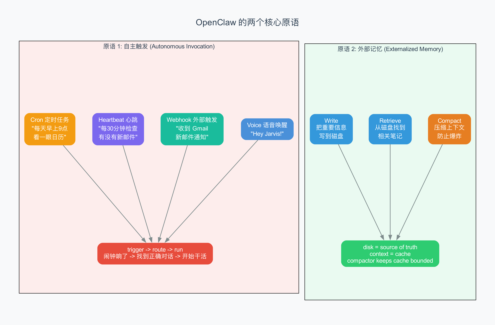
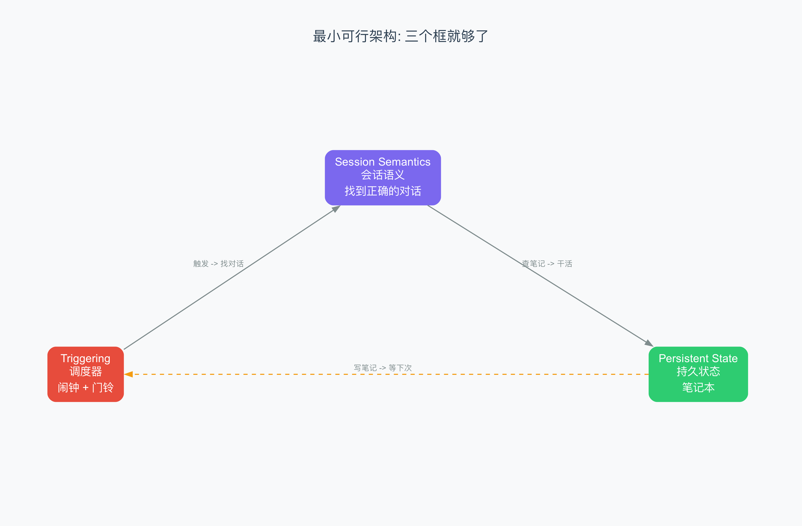

# 第 2 章 两个核心原语

> OpenClaw 的全部复杂性，可以归结为两个简单的东西：闹钟和笔记本。

## 2.1 从一个问题开始

上一章我们了解了 OpenClaw 是什么——一个始终在线的 AI 助手。但如果你是一个喜欢刨根问底的人，你可能会问：

**为什么一个能在 WhatsApp 上帮你订午餐、在 Telegram 上帮你查天气、在 Discord 上帮你管服务器的系统，它的核心其实只有两个东西？**

这个问题听起来有点离谱。一个拥有 335,000 GitHub 星标、43 万行 TypeScript 代码的项目，怎么可能只有两个核心概念？

但事实就是这样。而且这不是我说的——这是一位系统研究者的分析结论。

## 2.2 先说说现有的 AI 工具缺什么

在深入 OpenClaw 的核心之前，我们需要理解一个问题：**现有的 AI Agent 工具，到底缺了什么？**

你可能用过 Claude Code、ChatGPT 的 Canvas、或者 Cursor。这些工具都很强——它们能读代码、写代码、执行命令、搜索文件。它们有工具循环（tool loop，即 AI 反复调用工具直到任务完成的循环机制），有 Shell 访问权限，有文件操作能力，有浏览器控制，有规划能力。

但它们有一个共同的局限，用一句话概括就是：

> **你必须打字，它才干活。你不打字，它就在那里干等着。**

这就像一个非常有能力的厨师——他可以做出任何菜，但你必须亲自到厨房点菜。你不在的时候，厨房是空的，火是灭的，什么都不会发生。

用技术术语说，这叫"前景 Agent"（foreground agent）——它在前台等你操作，你在它才动。

OpenClaw 的创造者 Peter Steinberger 看到了这个空白。他问了一个简单的问题：

> **如果 AI 能在你不在的时候自主干活呢？**

要实现这个跨越，你不需要重新发明一切。你只需要在现有的 Agent 基础上，加上**两样东西**。

## 2.3 第一个原语：自主触发（Autonomous Invocation）

### 它不是简单的定时任务

听到"自主触发"，你可能会想："这不就是 cron（定时任务）吗？搞个定时器，每隔一段时间调一次 AI？"

没那么简单。

考虑这几个问题：

1. **触发之后，AI 应该在哪个对话里工作？** 是你正在和它聊天的那个对话，还是新建一个？
2. **AI 应该带着什么上下文（context，即 AI 当前的知识范围和工作记忆）去工作？** 是你上一次对话的内容，还是从头开始？
3. **后台任务会不会"污染"你正在进行的主对话？** 比如你在和 AI 讨论一个技术问题，突然后台任务插了一句"已帮你订好日料午餐"，这体验就很奇怪。

这不是简单的"定时跑一下模型"。这是一个**语义问题**——调用的"意义"是什么。

### 操作系统的类比

让我们用一个你可能更熟悉的类比：操作系统（Operating System，即管理计算机硬件和软件资源的系统程序）。

在操作系统里，调度器（scheduler，即决定哪个程序在什么时候使用 CPU 的组件）负责分配 CPU 时间。但一个光有调度器的系统是没法用的——因为调度器不知道"时间片该分配给谁"。

真正让调度器有用的是**进程身份**（process identity，即每个运行中的程序都有一个唯一标识和独立的状态空间）。调度器知道"进程 A 正在运行、进程 B 在等待"，它才能做出有意义的调度决策。

OpenClaw 的设计也是一样。它的自主触发不是"每隔 5 分钟跑一次模型"，而是：

> **trigger → route → run in (session namespace)**
> （触发 → 找到正确的对话 → 在那个对话的命名空间中运行）

三个步骤，缺一不可。

### OpenClaw 的五种触发方式

OpenClaw 支持多种触发方式，它们都遵循上面的三步流程：

| 触发方式 | 比喻 | 场景 |
|----------|------|------|
| **Cron（定时任务）** | 闹钟 | "每天早上 9 点检查日历" |
| **Heartbeat（心跳）** | 定时巡逻 | "每 30 分钟检查有没有新邮件" |
| **Webhook（外部通知）** | 门铃响了 | "Gmail 推送过来一条新邮件通知" |
| **消息到达** | 电话响了 | "有人在 WhatsApp 上给你发了消息" |
| **语音唤醒** | "Hey Jarvis!" | "你对着手机喊了一声" |

不管是哪种触发方式，系统都会：
1. 判断这个触发应该路由到哪个对话（session，即一次持续的交互上下文）
2. 在那个对话中运行 AI，带上正确的上下文
3. 如果需要隔离（比如后台任务不应该干扰主对话），就在独立的上下文中运行

### Session 隔离为什么重要

举一个具体的例子。假设：

- 你正在 WhatsApp 上和 AI 讨论一个 Python 技术问题
- 同时，一个后台心跳任务正在检查你的邮箱
- 又同时，有人在 Telegram 群里 @ 了你的 AI

如果这三个任务共享同一个对话上下文，结果就是一团糟：AI 可能在讨论 Python 的对话里突然插入"你有一封新邮件"，或者在回复 Telegram 群消息时带上了你 WhatsApp 聊天的内容。

OpenClaw 的解决方案是 **per-channel-peer 隔离**（即每个通道的每个用户都有独立的会话）。同一用户在 WhatsApp 和 Telegram 上有两个独立的 session，互不干扰。后台任务也可以运行在隔离的 Docker 容器中。



这就像操作系统里的进程隔离——每个进程有自己的内存空间，不能随便访问别人的。

所以，第一个原语的完整定义是：

> **自主触发 = trigger → route → run in (session namespace)**
>
> 不只是"定时跑一下模型"，而是"在正确的对话里、带着正确的上下文、跑正确的事情"。

## 2.4 第二个原语：外部记忆（Externalized Memory）

### AI 的"失忆症"

如果你用过 ChatGPT，你可能知道这个体验：你关掉一个对话窗口，再开一个新的，之前聊的内容就全忘了。每次都像在和一个刚失忆的人说话。

这是因为 AI 模型有一个硬限制——**上下文窗口**（context window，即 AI 一次性能处理的最大文本量）。Claude 的上下文窗口大约是 20 万 token（token 是 AI 处理文本的基本单位，大约 1 个中文字 ≈ 1-2 个 token），看起来很大，但聊久了就会满。满了怎么办？早期的 AI 就直接忘掉最老的内容。

OpenClaw 需要的是一种**不会失忆的 AI**。它今天帮你订了日料，明天应该记得你的口味。它上周帮你查了一个技术问题，下次遇到类似的应该能关联起来。

### 笔记本的比喻

想象你有一个助手，他的短期记忆（即 AI 的上下文窗口）只能记住最近 30 分钟的对话内容。超过 30 分钟的事情他就会忘。

怎么办？

你给他一个**笔记本**。每次重要的信息，他都记在笔记本上。下次需要的时候，他翻开笔记本查找。

这就是 OpenClaw 的外部记忆系统。用一句话概括核心思想：

> **把 AI 的上下文窗口当作缓存（cache，即高速但容量有限的数据暂存区），把磁盘上的文件当作事实来源（source of truth，即真正权威的数据存储）。然后加一个压缩器保持缓存不溢出，加一个检索器把需要的信息从磁盘调回来。**

如果你懂计算机，你会发现这就是**虚拟内存**（virtual memory，即操作系统用磁盘扩展内存容量的技术）的概念：

- **RAM（内存）** = AI 的上下文窗口，很快但容量有限
- **磁盘** = 本地 Markdown 文件，很大但访问较慢
- **分页机制**（paging）= 检索器，决定什么时候从磁盘调什么内容回来
- **内存压缩** = 上下文压缩器，把长的历史记录压缩成短的摘要

### 记忆系统的三个基本操作

Agent 记忆的最小需求，说到底就三件事：

**1. 写（Write）**

把重要信息写到磁盘上，存储在上下文窗口之外。

比如你在聊天时说了一句"我是素食主义者"，AI 会把这个信息写到 MEMORY.md 文件里。下次对话时，即使上下文窗口已经被新内容挤满了，这个信息也不会丢失。

**2. 查（Retrieve）**

之后能检索到正确的笔记。

当你在两周后问"我想吃什么来着"，AI 不会傻傻地回答"我不知道"。它会搜索磁盘上的笔记，找到"素食主义者"这个信息，然后给你推荐素食餐厅。

**3. 压（Compact）**

避免上下文爆炸。

即使有了外部记忆，AI 的上下文窗口还是会随着对话越来越长。OpenClaw 有一个 `/compact` 命令，会显式触发压缩——把长对话历史压缩成一个短摘要。这就像你读完了一本 300 页的书，写了一个 3 页的读书笔记——要点都在，但篇幅大大缩短。



### 一个精妙的正确性设计

这里有一个容易被忽略但非常重要的设计细节。

在压缩上下文之前，OpenClaw 会先执行一步"**立即写持久笔记**"的操作。什么意思？

想象你正在和 AI 讨论 10 个复杂的技术问题。聊到最后，上下文窗口快满了，需要压缩。压缩会把之前的详细讨论变成一个简短的摘要。

但问题是：**摘要可能丢掉一些重要的细节**。

所以 OpenClaw 的做法是：在压缩之前，先把所有重要信息写到磁盘上（持久化）。这样即使压缩丢失了一些细节，磁盘上的笔记还在。

这不是性能优化，这是**防止遗忘的最后一道防线**。如果信息在持久化之前就从上下文窗口中丢失了，那这个信息就**永远**丢了——AI 再也找不回来了。

就像考试前你把课本的重要内容抄到小抄上。考试时你不用翻课本，但万一时间不够、题目做不完，至少小抄上还有最关键的信息。

## 2.5 最小可行架构

如果把 OpenClaw 简化到极致，你需要的其实就三个框：

```
┌─────────────┐    ┌──────────────────┐    ┌─────────────────┐
│  Triggering  │───>│  Session         │───>│  Persistent     │
│  调度器      │    │  Semantics       │    │  State          │
│              │    │  会话语义        │    │  持久状态       │
│  · 闹钟      │    │                  │    │                 │
│  · 门铃      │    │  · 找到正确对话  │    │  · 笔记本       │
│  · 电话      │    │  · 任务隔离      │    │  · 检索器       │
│  · 定时巡逻  │    │  · 多Agent路由   │    │  · 压缩器       │
└─────────────┘    └──────────────────┘    └─────────────────┘
       ↑                                            │
       └────────────────────────────────────────────┘
                        写笔记，等下次触发
```

**框 1：触发（Triggering）**——什么事件会唤醒 AI？定时闹钟、外部通知、用户消息、语音指令。

**框 2：会话语义（Session Semantics）**——AI 被唤醒后，应该在哪个对话里工作？带什么上下文？后台任务会不会干扰主对话？

**框 3：持久状态（Persistent State）**——AI 记住的信息存在哪里？怎么检索？怎么防止上下文爆炸？

如果你非要把三框压缩成两框，就把会话语义折叠进触发，合称"调用基座"（invocation substrate，即管理"在什么时候、什么上下文里调用 AI"的基础机制）。两个原语就够了。

## 2.6 什么不是核心

理解了什么是核心之后，反过来也要理解**什么不是核心**。

以下这些东西，去掉任何一个都不影响 OpenClaw 的概念完整性。它们对于产品的健壮性和用户采用很重要，但不是架构创新的本质：

| 可以去掉的 | 为什么不是核心 |
|-----------|--------------|
| 你用哪个聊天平台 | 换个平台，架构不变 |
| 工具在容器里跑还是在宿主 OS 上跑 | 换个运行环境，架构不变 |
| 工具策略有多复杂 | 策略是配置，不是架构 |
| 你有一个 Agent 还是多个 | 数量是规模问题，不是概念问题 |
| 你有没有后台进程管理 | 管理方式是实现细节 |

这些东西是"锦上添花"。没有它们，系统依然成立。但没有自主触发和外部记忆，OpenClaw 就退化为一个普通的 ChatGPT 套壳应用。

## 2.7 为什么 Apple 没做到

在结束这章之前，我想分享一个来自系统分析文章的有趣观察。

Apple、Google、Microsoft 这三家公司，手下有几百上千个系统学博士。Apple 已经把 GPT 集成到 iPhone 里两年多了。但它们都没有做出来 OpenClaw 这样的东西。

为什么？

因为它们被自己的产品形态困住了。Apple 想的是"怎么让 Siri 更聪明"，Google 想的是"怎么让 Assistant 更好用"，Microsoft 想的是"怎么让 Copilot 写更多代码"。它们的思维模式都是"前景 Agent"——用户问，AI 答。

Peter Steinberger 的洞察是：问题不是"怎么让 AI 更聪明"，而是"怎么让 AI 在你不在的时候也能干活"。这是一个系统设计问题，不是一个 AI 能力问题。

而系统设计，恰恰是我们几十年积累下来的领域。OpenClaw 用到的模式——事件循环、持久状态、进程隔离——和操作系统、数据库、分布式系统用到的模式是一样的。

> **构建可靠的 AI 系统，本质上是一个系统设计问题。OpenClaw 是这个论点的一个案例研究。**

## 2.8 小结

让我们回顾这章学到的内容：

1. **现有 AI Agent 的局限**：它们是"前景 Agent"——你必须打字，它才干活
2. **第一个原语：自主触发**：trigger → route → run in session namespace，不只是"定时跑模型"，而是"在正确的对话里带着正确的上下文跑正确的事"
3. **第二个原语：外部记忆**：disk = source of truth, context = cache, compactor keeps cache bounded, retriever pages state back in——认知的虚拟内存
4. **最小架构**：触发 + 会话语义 + 持久状态，三个框就够了
5. **什么不是核心**：平台、容器、UI 都是锦上添花，可以去掉
6. **为什么这很重要**：构建可靠的 AI 系统本质上是系统设计问题

下一章，我们将在这两个原语的基础上，看看 OpenClaw 是怎么用三层架构（Gateway → Channel → LLM）来实现这两个原语的。

---

## 术语速查表

| 术语 | 解释 |
|------|------|
| Autonomous invocation | 自主触发，AI 不需要人工输入就能被激活执行任务 |
| Cache | 缓存，高速但容量有限的数据暂存区 |
| Compact | 压缩，把长的对话历史变成短的摘要以节省空间 |
| Context window | 上下文窗口，AI 一次性能处理的最大文本量 |
| Cron | 定时任务，按照时间表自动执行的操作 |
| Foreground agent | 前景智能体，需要人工触发才能工作的 AI |
| Heartbeat | 心跳，定期自动触发的检查机制 |
| Invocation substrate | 调用基座，管理"何时何地调用 AI"的基础机制 |
| Per-channel-peer | 每通道每用户，一种会话隔离策略 |
| Paging | 分页，操作系统用磁盘扩展内存容量的技术 |
| Process identity | 进程身份，每个运行中程序的唯一标识和状态空间 |
| Retrieve | 检索，从存储中找到需要的信息 |
| Scheduler | 调度器，决定哪个程序什么时候使用 CPU 的组件 |
| Session | 会话，一次持续的交互上下文 |
| Session namespace | 会话命名空间，隔离不同会话的状态空间 |
| Source of truth | 事实来源，真正权威的数据存储 |
| Token | AI 处理文本的基本单位，大约 1 个中文字 ≈ 1-2 个 token |
| Trigger | 触发器，引起 AI 开始工作的事件 |
| Virtual memory | 虚拟内存，用磁盘扩展 RAM 容量的技术 |
| Webhook | 外部系统推送过来的 HTTP 通知 |
