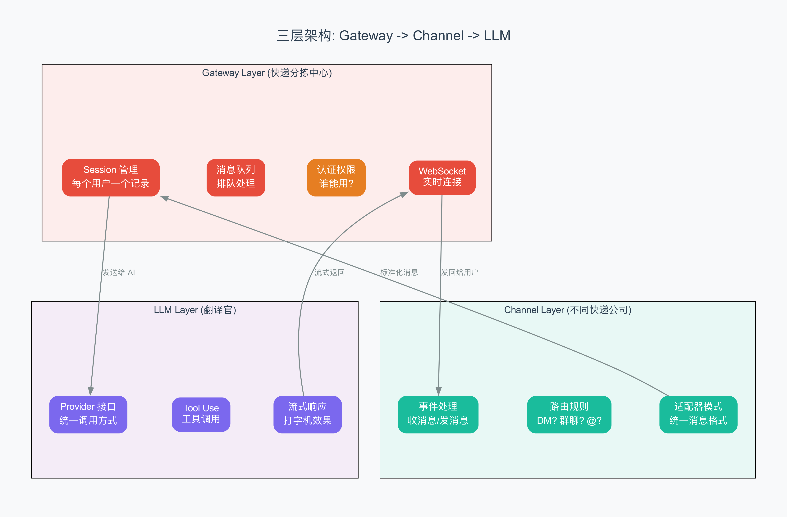
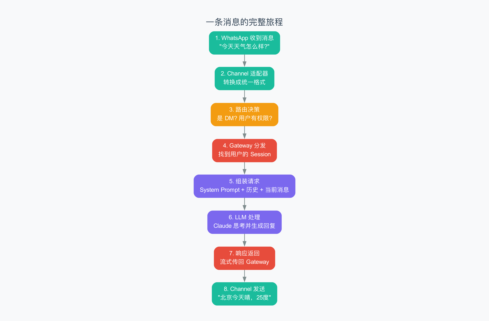

# 第 3 章 三层架构与消息流

> Gateway 是分拣中心，Channel 是快递员，LLM 是翻译官。

## 3.1 从两个原语到三层架构

上一章我们说 OpenClaw 的全部复杂性可以归结为两个原语：自主触发和外部记忆。但光有概念还不够——你得用代码把它实现出来。

OpenClaw 用一种叫**三层架构**（three-layer architecture）的方式来实现这两个原语。三层之间职责清晰、互不干扰：

| 层 | 比喻 | 职责 |
|---|------|------|
| **Gateway（网关层）** | 快递分拣中心 | 会话管理、消息队列、认证权限 |
| **Channel（通道层）** | 不同快递公司 | 平台适配、消息路由、格式转换 |
| **LLM（模型层）** | 翻译官 | Provider 接口、工具调用、流式响应 |



用快递的类比来理解：你在北京寄一个包裹到上海。不同的快递公司（顺丰、中通、圆通）各自收包裹——这就像不同的 Channel（WhatsApp、Telegram、Discord）各自收消息。包裹被送到分拣中心（Gateway），分拣中心根据目的地分配到对应的路线——就像 Gateway 根据路由规则把消息分配到正确的会话。最后包裹被送上飞机或火车——就像消息被发送给 LLM（AI 大脑）处理。

这个分层的精妙之处在于：**每一层只管自己的事情**。想加一个新的快递公司（消息平台）？只改 Channel 层。想换一种运输方式（换 AI 模型）？只改 LLM 层。分拣中心（Gateway）完全不用动。

## 3.2 Gateway 层：快递分拣中心

Gateway 是 OpenClaw 的心脏。它是一个持续运行的后台进程（daemon，即一直在后台默默运行的程序），负责：

### 1. 连接管理

Gateway 同时支持两种网络协议：

- **WebSocket**（双向实时通信协议）：用于和 Companion Apps（iOS/Android/macOS 应用）通信。WebSocket 的好处是服务器可以主动推送消息给客户端，不需要客户端反复来问"有没有新消息？"
- **HTTP**：用于和 Channel 的 Webhook（外部系统推送过来的通知）通信。当 WhatsApp 收到新消息时，它会通过 HTTP POST 把消息推送给 Gateway。

### 2. 会话管理

每个用户在每个消息平台上都有一个独立的 Session（会话）。Gateway 负责创建、查找、更新和归档这些 Session。

关键设计：**per-channel-peer 隔离**。同一个用户在 WhatsApp 和 Telegram 上是两个独立的 Session，互不干扰。这样你在 WhatsApp 上讨论的技术问题不会污染 Telegram 上的日常闲聊。

### 3. 消息队列与调度

Gateway 不会一来消息就立即丢给 LLM。它有一个消息队列（message queue，即消息排队等待处理的缓冲区），按先进先出的顺序处理。

为什么需要队列？因为 LLM API 有并发限制（rate limit，即单位时间内允许的最大请求数）。如果 100 个用户同时发消息，你不能同时发出 100 个 LLM 请求——API 会拒绝。队列可以控制并发数，比如最多同时处理 10 个请求，剩下的排队等待。

### 4. 认证与权限

不是所有人都能用你的 OpenClaw。Gateway 有认证机制，确认"这个请求来自谁，他有没有权限"。支持的认证方式包括：

- **Token 认证**：启动时生成一个访问令牌，客户端连接时必须提供
- **设备配对**：手机 App 通过扫码或配对码与 Gateway 建立信任关系
- **Allowlist**：只允许白名单中的用户和 AI 对话

### 5. 启动引导

Gateway 启动时会执行一个特殊的引导流程，来自 `boot.ts` 的源码。它会：

1. 检查工作目录下有没有 `BOOT.md` 文件
2. 如果有，读取文件内容，构建一个引导 Prompt
3. 用这个 Prompt 调用 AI，让 AI 执行启动指令
4. 执行完毕后恢复主会话映射（防止引导任务污染正常会话）

这就像一个管家每天早上来上班时，先看一眼你留下的"今日待办"清单，把该做的准备工作做好。

## 3.3 Channel 层：不同快递公司

Channel 层解决一个核心问题：**不同的消息平台格式完全不同，怎么统一处理？**

### 适配器模式

WhatsApp 的消息长这样：

```json
{
  "from": "8613800138000",
  "body": "今天天气怎么样?",
  "type": "text"
}
```

Telegram 的消息长这样：

```json
{
  "message": {
    "chat": { "id": 123456 },
    "text": "今天天气怎么样?"
  }
}
```

Discord 的消息又不一样。如果为每个平台写一套逻辑，代码就会爆炸式增长。

OpenClaw 用经典的**适配器模式**（Adapter Pattern，一种设计模式，把不同的接口统一成一个标准接口）解决这个问题。它定义了一个统一的 `StandardMessage` 格式：

```typescript
interface StandardMessage {
  userId: string;      // 统一的用户 ID
  content: string;     // 消息内容
  timestamp: number;   // 时间戳
  metadata: any;       // 平台特有数据
}
```

每个 Channel 的适配器负责把平台特有的消息格式转换成这个标准格式。Gateway 和 LLM 层只处理 `StandardMessage`，不关心消息来自哪个平台。


### 路由规则

Channel 层还有一个重要职责：**决定哪些消息应该被回复，哪些应该被忽略**。

OpenClaw 支持多种路由规则，从 `resolve-route.ts` 源码中可以看到一个 **7 级优先级** 的路由匹配系统：

| 优先级 | 匹配方式 | 说明 |
|--------|---------|------|
| 1 | `binding.peer` | 精确匹配某个用户/群组 |
| 2 | `binding.peer.parent` | 匹配线程的父级 |
| 3 | `binding.guild+roles` | 匹配 Discord 服务器 + 角色组合 |
| 4 | `binding.guild` | 匹配 Discord 服务器 |
| 5 | `binding.team` | 匹配 Slack 团队 |
| 6 | `binding.account` | 匹配账号 |
| 7 | `binding.channel` | 匹配通道（通配符 `*`） |
| - | `default` | 都没匹配到，用默认 Agent |

这个多级路由系统就像快递分拣中心的优先级规则——"同城急件优先处理，其次是省内件，最后是跨省件"。消息进来后，从最高优先级开始逐级匹配，找到第一个命中的规则就确定路由目标。

对于直聊（DM，Direct Message），有四种策略：

| 策略 | 说明 |
|------|------|
| `pairing` | 需要先配对才能聊天（最安全） |
| `allowlist` | 只有白名单里的用户可以使用 |
| `open` | 所有人都可以使用（公开机器人） |
| `disabled` | 禁用直聊 |

对于群聊，有**提及门控**（mention gating）——只有 @ 了机器人的消息才会被回复。这避免了机器人在群里对每条消息都插嘴的尴尬。

### 会话键构建

路由确定后，系统需要构建一个**会话键**（session key，即唯一标识一个会话的字符串）。从源码中可以看到：

```typescript
buildAgentSessionKey({
  agentId,
  channel,
  accountId,
  peer,         // { kind: "direct"|"group"|"channel", id: "xxx" }
  dmScope,      // "main" | "per-peer" | "per-channel-peer" | "per-account-channel-peer"
})
```

`dmScope` 决定了直聊的会话隔离粒度：

- `main`：所有直聊共享一个会话
- `per-peer`：每个用户一个会话
- `per-channel-peer`：每个通道的每个用户一个会话（默认）
- `per-account-channel-peer`：每个账号的每个通道的每个用户一个会话

这种灵活的隔离粒度让系统可以适应不同的使用场景。

## 3.4 LLM 层：翻译官

LLM 层负责和 AI 大脑打交道。它的核心是**Provider 插件系统**。

### Provider 接口

OpenClaw 定义了一个统一的 `LLMProvider` 接口：

```typescript
interface LLMProvider {
  name: string;          // 'anthropic', 'openai', 'ollama'
  
  // 发送消息，返回流式响应
  chat(messages, options): AsyncIterator<string>;
  
  // 是否支持工具调用
  supportTools(): boolean;
  
  // 初始化配置
  initialize(config): void;
}
```

所有 Provider 只需要实现这个接口就能集成到系统中。系统在启动时自动扫描和注册所有 Provider。想用新模型？写一个 Provider 实现类，注册一下就行，核心代码完全不用改。

目前支持的主要 Provider：

| Provider | 特点 |
|----------|------|
| **Anthropic (Claude)** | 原生流式响应，200k 上下文窗口，特殊 Tool Use 格式 |
| **OpenAI (GPT)** | Function Calling，流式需手动拼接，严格 RPM/TPM 限制 |
| **Ollama (本地模型)** | 无需 API Key，CPU 推理较慢，工具支持因模型而异 |

### Tool Use 机制

Tool Use（工具调用，即 AI 决定调用某个工具来完成任务的能力）是 LLM 层的核心特性。

当你问"北京今天天气怎么样？"时，AI 的处理流程是：

1. **判断**：我需要调用 `get_weather` 工具
2. **请求**：返回 `{ "name": "get_weather", "args": { "city": "北京" } }`
3. **执行**：OpenClaw 执行工具，返回 `{ "temp": "25°C", "condition": "晴" }`
4. **回答**：AI 根据结果生成："北京今天晴，25 度"

OpenClaw 的工具注册机制是声明式的——每个工具有一个 `ToolSpec`（工具规范），包含名称、描述和参数格式。AI 根据这些信息自主决定调用哪个工具。

### 流式响应

LLM 的回复不是一口气全吐出来的，而是像打字机一样一个字一个字地蹦出来。这种技术叫**流式响应**（streaming response）。

OpenClaw 的事件流有三种类型：

| Stream 类型 | 比喻 | 说明 |
|------------|------|------|
| `assistant` | AI 说话 | AI 的文字回复，逐字输出 |
| `tool` | AI 动手 | 工具调用状态（开始/执行中/完成） |
| `lifecycle` | 状态变化 | 运行生命周期（开始/结束/出错） |


这些事件通过 WebSocket 实时推送给所有连接的客户端，让用户看到"AI 正在思考..."、"AI 正在调用天气工具..."、"AI 已经完成回复"这样的实时状态。

## 3.5 完整消息流：一条消息的旅程

现在让我们把三层串起来，看一条消息从用户发出到收到回复的完整旅程。



**第 1 步：WhatsApp 收到消息**

你在 WhatsApp 上给机器人发了一条消息："今天天气怎么样？"

**第 2 步：Channel 适配器转换格式**

WhatsApp Channel 的适配器把消息从 WhatsApp 特有格式转换成 `StandardMessage`：

```json
{
  "userId": "8613800138000",
  "content": "今天天气怎么样?",
  "timestamp": 1709312345,
  "metadata": { "platform": "whatsapp" }
}
```

**第 3 步：路由决策**

路由系统检查：这是 DM（直聊）还是群聊？这个用户有权限吗？

`resolve-route.ts` 中的 7 级路由系统开始工作：
1. 检查有没有精确绑定这个用户的规则 → 没有
2. 检查有没有通配符绑定 → 没有
3. 都没有 → 使用默认 Agent

同时，根据 `dmScope` 配置，构建会话键：`openclaw__whatsapp__default__direct__8613800138000`

**第 4 步：Gateway 分发**

Gateway 找到（或创建）这个会话键对应的 Session，把消息加入处理队列。

**第 5 步：组装请求**

Gateway 组装发送给 LLM 的请求：
- System Prompt（SOUL.md + MEMORY.md + 当前时间等信息）
- 对话历史（之前聊过的内容）
- 当前消息："今天天气怎么样?"

**第 6 步：LLM 处理**

选择的 Provider（比如 Anthropic）把请求发给 Claude。Claude 开始思考，决定需要调用天气工具。

**第 7 步：工具调用循环**

AI → 调用 `get_weather(city="北京")` → Gateway 执行工具 → 返回结果 `{ "temp": "25°C" }` → AI 根据结果生成最终回复

**第 8 步：Channel 发送回复**

Gateway 把 AI 的最终回复通过 WhatsApp Channel 发回给你："北京今天晴，25 度，适合出门散步！"

整个旅程涉及三层，但每一层只做自己份内的事。

## 3.6 为什么这种分层很重要

你可能会想：搞这么复杂有必要吗？直接把消息从 WhatsApp 丢给 AI 不就行了？

小规模确实可以。但 OpenClaw 需要：
- 支持 20+ 个消息平台
- 同时管理数千个用户的会话
- 支持多个 AI 模型随时切换
- 允许开发者扩展新功能

如果没有分层，改一个地方可能影响所有地方。有了分层，每一层可以独立修改、独立测试、独立扩展。

用一句话概括：

> **分层不是为了复杂，而是为了让每一层的复杂度被限制在自己的边界内，不会像面条一样纠缠在一起。**

## 3.7 小结

这章我们学习了：

1. **三层架构**：Gateway（分拣中心）→ Channel（快递公司）→ LLM（翻译官），各司其职
2. **Gateway 核心**：连接管理、会话管理、消息队列、认证、启动引导
3. **Channel 适配器**：用适配器模式统一 20+ 消息平台的格式差异
4. **7 级路由系统**：从精确匹配到通配符的优先级路由，决定消息去哪
5. **LLM Provider**：插件式 AI 模型接口，支持工具调用和流式响应
6. **完整消息流**：8 步旅程，从 WhatsApp 消息到 AI 回复

下一章，我们将深入 OpenClaw 的"灵魂"——System Prompt 和身份系统，看看 AI 是怎么知道"我是谁、我该怎么做"的。

---

## 术语速查表

| 术语 | 解释 |
|------|------|
| Adapter pattern | 适配器模式，把不同接口统一成一个标准接口的设计模式 |
| AsyncIterator | 异步迭代器，支持逐个产出结果的数据流 |
| Binding | 绑定，将特定条件（用户/群组/服务器）映射到特定 Agent 的规则 |
| Channel | 通道，连接消息平台的适配器层 |
| Daemon | 守护进程，一直在后台默默运行的程序 |
| DM (Direct Message) | 直聊/私信，一对一的聊天方式 |
| dmScope | 直聊作用域，控制直聊会话的隔离粒度 |
| Function Calling | 函数调用，AI 决定调用某个函数的能力（OpenAI 的叫法） |
| Gateway | 网关，系统的核心枢纽，管理连接、会话和消息分发 |
| LLMProvider | LLM 提供者接口，统一不同 AI 模型的调用方式 |
| Mention gating | 提及门控，只在被 @ 时才回复的策略 |
| Per-channel-peer | 每通道每用户，一种会话隔离策略 |
| Rate limit | 速率限制，API 对单位时间内请求数的限制 |
| RPM/TPM | Requests/Tokens Per Minute，每分钟请求/令牌数 |
| Session key | 会话键，唯一标识一个会话的字符串 |
| StandardMessage | 标准消息格式，OpenClaw 内部统一的消息表示 |
| Streaming response | 流式响应，AI 像打字机一样逐字输出 |
| ToolSpec | 工具规范，描述一个工具的名称、功能和参数格式 |
| Tool Use | 工具使用，AI 调用外部工具完成任务的能力 |
| Webhook | HTTP 回调，外部系统推送通知的方式 |
