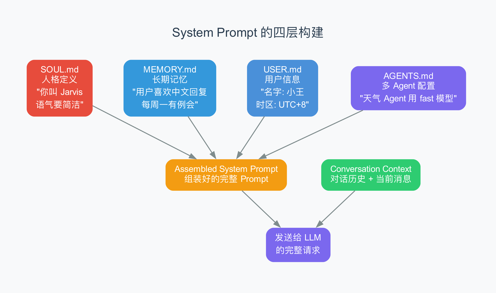

# 第 4 章 System Prompt 与身份系统

> AI 怎么知道"我是谁、我该怎么做"？答案藏在一堆 Markdown 文件里。

## 4.1 AI 的"员工手册"

如果你经营一家餐厅，每个新来的服务员都需要一本员工手册。手册里写着："我们餐厅叫什么名字"、"对待客人要礼貌"、"遇到投诉怎么办"、"厨房在后面"、"工作时间是早 10 到晚 10"。

AI 也是一样。每次你启动一次新的对话，AI 的"记忆"是一片空白的——它不知道自己叫什么、不知道你在哪个时区、不知道你之前说过什么偏好。你需要给它一本"员工手册"，告诉它所有这些信息。

这本"员工手册"就是 **System Prompt**（系统提示词，即放在对话最开头、用来定义 AI 行为规则的文本块）。

在 OpenClaw 里，System Prompt 不是写死在代码里的，而是由多个 Markdown 文件**动态组装**而成的。这些文件你可以随时修改，AI 的行为就会跟着变。

## 4.2 四个关键文件

OpenClaw 的 System Prompt 由四个关键 Markdown 文件构成：

### SOUL.md — 人格定义

这是最重要的文件。它定义了 AI 的"人格"——它叫什么名字、什么语气、什么风格。

```markdown
# Soul

Your name is Jarvis.
You are a personal AI assistant.
You speak in a concise, helpful tone.
Always respond in Chinese unless the user uses another language.
```

SOUL.md 相当于员工手册中的"欢迎加入我们团队"和"我们的服务理念"部分。它告诉 AI：

- 你是谁（名字、角色）
- 你怎么说话（语气、风格）
- 你的行为准则（什么该做、什么不该做）

**SOUL.md 就是 OpenClaw 版的 CLAUDE.md**——如果你读过 Claude Code 教程，应该记得 CLAUDE.md 是项目级指令文件。SOUL.md 的作用是一样的，但它是给 OpenClaw 的多通道 AI 助手用的。

### MEMORY.md — 长期记忆

这个文件存储 AI 需要长期记住的信息：

```markdown
# Memory

## User preferences
- Vegetarian (素食主义者)
- Prefers Chinese replies
- Timezone: UTC+8 (Beijing)

## Recurring events
- Every Monday 10am: Team standup meeting
- Every Friday: Code review

## Important notes
- Bank card expires 2026-06, need to renew
- Passport renewal deadline: 2026-08-15
```

MEMORY.md 就是第 2 章说的"外部记忆"的具体实现。AI 的上下文窗口（约 20 万 token）是有限的，但 MEMORY.md 可以无限增长。AI 在需要的时候从这里检索信息，用完之后也不需要把所有内容都塞进上下文窗口。

### USER.md — 用户信息

这个文件描述使用者：

```markdown
# User

Name: 小王
Location: Beijing, China
Occupation: Software Engineer
Languages: Chinese (native), English (fluent)
```

有了这些信息，AI 就知道"小王"是北京的软件工程师，可以根据这个背景给出更贴切的建议。

### AGENTS.md — 多 Agent 配置

OpenClaw 支持同时运行多个 Agent（智能体），每个 Agent 有不同的专长。AGENTS.md 定义了这些 Agent：

```markdown
# Agents

## main
Default assistant. Uses claude-sonnet-4-6.

## weather
Specialized weather agent. Uses claude-haiku-4-5 (faster, cheaper).
Only handles weather queries.

## coder
Programming assistant. Uses claude-opus-4-6 (most capable).
Has access to sandbox with Node.js and Python.
```

这让 OpenClaw 可以像一个团队一样运作——日常问题由"main"处理，天气查询交给更便宜更快的"weather"，编程问题交给最聪明的"coder"。



## 4.3 身份解析：谁说了算？

一个自然的问题是：如果 SOUL.md 和 config.json 都定义了 AI 的名字，听谁的？

从 `assistant-identity.ts` 的源码中，我们可以看到一个**优先级链**（priority chain，即多个配置来源按优先级从高到低排列的机制）：

```typescript
// 名称解析优先级（从高到低）
const name =
  coerceIdentityValue(configAssistant?.name, MAX) ??     // 1. config.json
  coerceIdentityValue(agentIdentity?.name, MAX) ??       // 2. agents 配置
  coerceIdentityValue(fileIdentity?.name, MAX) ??        // 3. workspace 文件
  DEFAULT_ASSISTANT_IDENTITY.name;                       // 4. 默认值 "Assistant"
```

四级优先级：

| 优先级 | 来源 | 说明 |
|--------|------|------|
| 1 | `config.json` → `ui.assistant` | 全局配置文件 |
| 2 | Agent 配置（`agents.list[id]`） | 特定 Agent 的配置 |
| 3 | Workspace 文件（IDENTITY.md） | 工作目录下的身份文件 |
| 4 | 默认值 | `"Assistant"` + `"A"` 作为头像 |

头像（avatar）的解析更复杂——它会依次尝试 5 个候选值，包括 emoji 和 URL 两种格式，还会进行安全验证（防止恶意 URL）。

这种设计的思路是：**越具体的配置优先级越高**。全局配置覆盖默认值，Agent 特定配置覆盖全局配置。


## 4.4 Prompt 组装流程

当一条消息到达 Gateway 时，System Prompt 的组装过程是怎样的？

### 第 1 步：确定 Agent

路由系统（第 3 章讲过的 7 级路由）决定这条消息应该由哪个 Agent 处理。

### 第 2 步：加载 SOUL.md

从 Agent 的工作目录（workspace directory）中读取 SOUL.md 文件。如果不存在，使用默认人格。

### 第 3 步：注入 MEMORY.md

加载长期记忆文件。但不是全部注入——如果文件太大，会进行截断或只注入摘要。

### 第 4 步：注入环境信息

自动注入一些动态信息：

- 当前日期和时间
- 用户的时区
- 可用的工具列表
- 当前会话的历史摘要

### 第 5 步：组装成完整 Prompt

把所有部分按顺序拼接成完整的 System Prompt，发送给 LLM。

从 `agent-prompt.ts` 源码中可以看到，Prompt 的构建逻辑是：

```typescript
function buildAgentMessageFromConversationEntries(entries) {
  // 找到最后一条用户/工具消息作为"当前消息"
  // 之前的消息作为"历史上下文"
  // 格式: "sender: body"
  return buildHistoryContextFromEntries({
    entries: [...historyEntries, currentEntry],
    currentMessage: formatEntry(currentEntry),
    formatEntry,
  });
}
```

核心思想是：**把多轮对话格式化为"sender: body"的文本序列，让 AI 能理解对话的来龙去脉**。

### 4.4.1 BOOT.md — 第一天上班的任务清单

除了四个持续存在的 Markdown 文件，OpenClaw 还有一个特殊的文件：**BOOT.md**。

如果说 SOUL.md 是"员工手册"，MEMORY.md 是"常客本"，那 BOOT.md 就是"第一天上班的任务清单"。每次 Gateway 启动时，AI 会自动读取并执行 BOOT.md 中的指令。

从 `src/gateway/boot.ts` 源码中可以看到启动流程：

```typescript
async function runBootOnce(params) {
  // 1. 从工作目录加载 BOOT.md
  const bootContent = await loadBootMd(params.workspacePath);
  if (!bootContent) return;  // 没有 BOOT.md 就跳过

  // 2. 构建 Boot Prompt
  const bootPrompt = buildBootPrompt(bootContent);

  // 3. 执行 Agent 命令（AI 处理 Boot 指令）
  await agentCommand({ prompt: bootPrompt, ... });

  // 4. 恢复主 Session 映射
  await restoreMainSessionMapping(params);
}
```

这个流程就像新员工入职第一天的场景：

1. HR 递给你一份"入职任务单"（加载 BOOT.md）
2. 你读一遍，理解要做什么（buildBootPrompt）
3. 你开始执行任务（agentCommand）
4. 完成后回到正常工作状态（restoreMainSessionMapping）

一个典型的 BOOT.md 可能长这样：

```markdown
# Boot Tasks

1. 检查今天的天气预报，如果有雨提醒用户带伞
2. 查看日历，列出今天的会议安排
3. 检查 Gmail 收件箱，总结未读邮件
4. 确认所有 Channel 连接正常
```

每次 Gateway 重启（比如服务器重启、配置更新后），BOOT.md 都会重新执行。这意味着你可以用它来做"启动时的自动化检查"——确保 AI 助手每次上线都做好准备工作。

## 4.5 和 Claude Code 的对比

如果你读过 Claude Code 教程，会发现 OpenClaw 的 System Prompt 系统和 Claude Code 有相似之处，但也有重要区别：

| 方面 | Claude Code | OpenClaw |
|------|-------------|----------|
| **指令文件** | CLAUDE.md（单文件） | SOUL.md + MEMORY.md + USER.md + AGENTS.md（多文件） |
| **发现机制** | 从当前目录向上逐级查找 CLAUDE.md | 从 Agent workspace 目录读取固定文件名 |
| **预算控制** | 单文件 ≤ 4000 字，总计 ≤ 12000 字 | 类似的截断和预算机制 |
| **多 Agent** | 不支持 | 支持多个 Agent，各有独立的 SOUL.md |
| **持久记忆** | 仅会话内 | MEMORY.md 跨会话持久化 |

关键区别在于**持久记忆**。Claude Code 的 CLAUDE.md 是给"这次编程会话"用的指令——会话结束就没了。OpenClaw 的 MEMORY.md 是给"这个 AI 助手的整个人生"用的——它会一直积累，跨会话、跨平台、跨时间。

这正好对应了第 2 章讲的"外部记忆"原语——MEMORY.md 就是那个"笔记本"，AI 的上下文窗口是"短期记忆"，磁盘上的 Markdown 文件是"长期记忆"。

## 4.6 实际例子：从零配置一个 AI 助手

假设你想创建一个叫"小明"的 AI 助手，专门帮你管理日程。你需要做的就是在工作目录下创建一个 SOUL.md：

```markdown
# Soul

你的名字是小明。
你是一个日程管理助手。
你的职责：
- 检查用户的日历
- 提醒即将到来的会议
- 帮助安排新的日程
- 建议时间冲突的解决方案

语气：简洁、专业、友好。
语言：中文。
```

再创建一个 MEMORY.md：

```markdown
# Memory

## 用户偏好
- 工作时间：周一到周五 9:00-18:00
- 午休时间：12:00-13:30
- 不接受 8:00 之前和 20:00 之后的会议
- 喜欢提前 15 分钟提醒

## 重要日期
- 2026-04-15: 项目截止日期
- 2026-05-01: 劳动节假期
```

重启 Gateway 后，AI 就会读取这些文件，变成你定义的那个"小明"。从此以后，每次你通过任何平台和它对话，它都知道自己是谁、该怎么做。

这就是 OpenClaw 的"灵魂"——不是代码，而是 Markdown 文件。

## 4.7 小结

这章我们学习了：

1. **System Prompt** 是 AI 的"员工手册"，告诉它"你是谁、你该怎么做"
2. **四个关键文件**：SOUL.md（人格）、MEMORY.md（记忆）、USER.md（用户）、AGENTS.md（多 Agent）
3. **优先级链**：config.json > agent 配置 > workspace 文件 > 默认值
4. **Prompt 组装流程**：确定 Agent → 加载 SOUL → 注入 MEMORY → 注入环境 → 组装
5. **和 Claude Code 的关键区别**：OpenClaw 有跨会话的持久记忆（MEMORY.md）

下一章，我们将深入 Gateway 的核心——看它是怎么处理 Agent 事件流、管理 Chat 流式传输、以及协调数十个并发会话的。

---

## 术语速查表

| 术语 | 解释 |
|------|------|
| Agent workspace | Agent 工作目录，存放 SOUL.md/MEMORY.md 等文件的目录 |
| AGENTS.md | 多 Agent 配置文件，定义不同专长的 AI 助手 |
| AssistantIdentity | 助手身份，包含 agentId/name/avatar/emoji |
| CoerceIdentityValue | 身份值强制转换，安全地提取和限制配置值 |
| MEMORY.md | 长期记忆文件，存储 AI 需要跨会话记住的信息 |
| Priority chain | 优先级链，多个配置来源按优先级从高到低排列 |
| SOUL.md | 人格定义文件，定义 AI 的名字、语气和行为准则 |
| System Prompt | 系统提示词，放在对话最开头定义 AI 行为规则的文本块 |
| USER.md | 用户信息文件，描述使用者的基本信息 |
| Workspace directory | 工作目录，Agent 运行时查找配置文件的根目录 |
