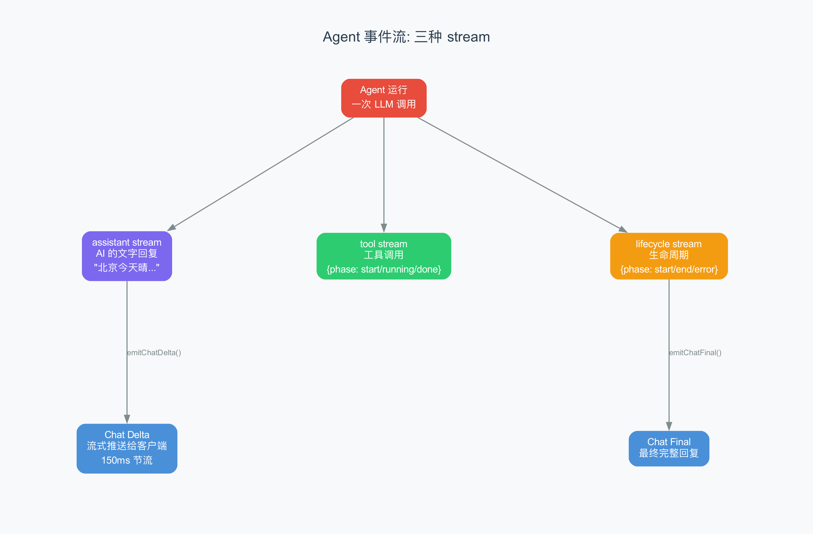
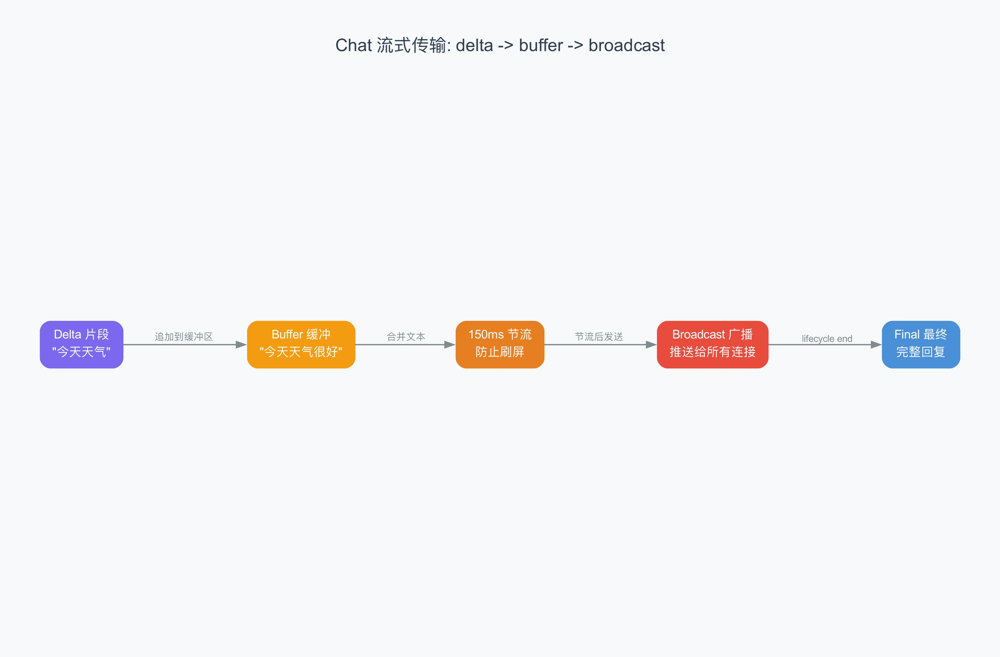
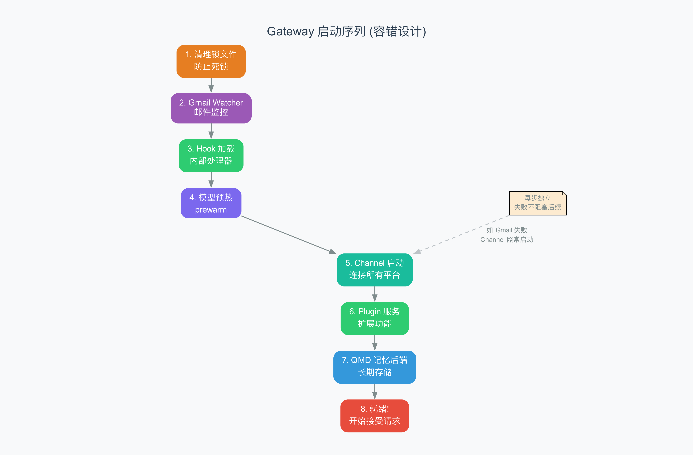

# 第 5 章 Gateway 核心与事件流

> 每秒处理数千条消息的"分拣中心"，靠的是一个 150ms 的节流阀。

## 5.1 从上一章到这里

上一章我们看了 System Prompt——AI 的"员工手册"。现在让我们深入 OpenClaw 的心脏：Gateway（网关）。

Gateway 是整个系统最复杂的部分。它要同时处理 WebSocket 连接、HTTP 请求、Agent 事件流、Chat 流式传输、会话状态管理、配置热重载……如果 OpenClaw 是一家餐厅，Gateway 就是厨房——所有的食材（消息）都从这里进出，所有的厨师（Agent）都在这里工作。

## 5.1 双协议架构

Gateway 同时支持两种网络协议：

### WebSocket — 实时通信

WebSocket（双向实时通信协议）用于和需要实时交互的客户端通信：Companion Apps（iOS/Android/macOS 应用）和 Control UI（浏览器管理界面）。

WebSocket 的好处是**服务器可以主动推送消息给客户端**。AI 生成回复时，可以一个字一个字地推送，用户看到的就是"打字机效果"。这比 HTTP 的"客户端问一次、服务器答一次"模式体验好得多。

从 `server.impl.ts` 源码中可以看到，WebSocket 连接的管理非常复杂：

- **心跳检测**：定期发送 ping，检测连接是否存活
- **自动重连**：断开后指数退避重连（1 秒 → 2 秒 → 4 秒 → 最大 30 秒）
- **状态同步**：重连后自动恢复 Session 状态
- **连接数限制**：防止资源耗尽

### HTTP — Webhook 和 API

HTTP 用于：

- **Webhook 接收**：消息平台（WhatsApp、Telegram 等）通过 HTTP POST 把新消息推送给 Gateway
- **OpenAI 兼容 API**：Gateway 暴露了一个和 OpenAI API 兼容的 HTTP 接口，让其他工具可以直接调用
- **Control UI**：浏览器通过 HTTP 访问管理界面

## 5.2 Agent 事件流

当 AI 开始处理一条消息时，它会产生一系列事件（event，即系统中发生的、可以被监听和处理的异步通知）。OpenClaw 定义了三种事件流（event stream，即一系列按时间顺序排列的事件）：



### 1. Assistant Stream — AI 的文字输出

AI 在思考过程中产生的文字片段：

```json
{ "stream": "assistant", "data": { "text": "北京今天", "delta": "今天" } }
{ "stream": "assistant", "data": { "text": "北京今天晴，25度", "delta": "晴，25度" } }
```

每个事件包含两个字段：
- `text`：到目前为止的完整文本
- `delta`：这次新增的文本片段

### 2. Tool Stream — 工具调用状态

AI 调用工具时的状态更新：

```json
{ "stream": "tool", "data": { "phase": "start", "name": "get_weather" } }
{ "stream": "tool", "data": { "phase": "running", "name": "get_weather" } }
{ "stream": "tool", "data": { "phase": "done", "name": "get_weather", "result": {...} } }
```

工具调用的三个阶段就像快递的"已下单 → 配送中 → 已送达"。

### 3. Lifecycle Stream — 生命周期事件

Agent 运行的开始和结束：

```json
{ "stream": "lifecycle", "data": { "phase": "start" } }
{ "stream": "lifecycle", "data": { "phase": "end", "stopReason": "end_turn" } }
```

或者出错时：

```json
{ "stream": "lifecycle", "data": { "phase": "error", "error": "API rate limit exceeded" } }
```

## 5.3 Chat 流式传输：delta → buffer → broadcast

这是 Gateway 中最精妙的部分之一。让我们一步步看它是怎么工作的。



### 问题：AI 太快了

AI 生成文字的速度非常快——每秒可以输出几十个字。如果把每个字都立刻推送给客户端，就会造成"刷屏"：客户端在一瞬间收到几十条消息，每条只有一个字，界面疯狂闪烁。

### 解决方案：150ms 节流

OpenClaw 的解决方案在 `server-chat.ts` 源码中清晰可见：

```typescript
const now = Date.now();
const last = chatRunState.deltaSentAt.get(clientRunId) ?? 0;
if (now - last < 150) {
  return;  // 距离上次发送不到 150ms，跳过
}
chatRunState.deltaSentAt.set(clientRunId, now);
```

核心逻辑很简单：

1. **Delta 到达**：AI 产出一个文字片段（delta）
2. **追加到 Buffer**：把 delta 追加到缓冲区（buffer，即临时存储数据的内存区域）
3. **检查节流**：距离上次广播是否超过 150ms？
   - 如果没有 → 跳过，等下次
   - 如果有 → 把 buffer 中累积的完整文本广播给所有客户端
4. **广播**：发送给所有通过 WebSocket 连接的客户端

这个 150ms 的阈值是怎么来的？人眼大约每 100-200ms 能感知一次变化。150ms 在这个范围内——足够频繁让用户感觉"AI 在实时打字"，又不会太频繁导致刷屏。

### 消息合并

还有一个精妙的细节——文本合并（merge）。有时候 AI 会重复发送已有的文本，有时候只发增量。`resolveMergedAssistantText` 函数处理这些情况：

```typescript
function resolveMergedAssistantText(params) {
  const { previousText, nextText, nextDelta } = params;
  // 情况 1: nextText 包含 previousText → 直接用 nextText
  if (nextText && previousText && nextText.startsWith(previousText)) {
    return nextText;
  }
  // 情况 2: 只有 delta → 追加到 previousText
  if (nextDelta) {
    return appendUniqueSuffix(previousText, nextDelta);
  }
  // 情况 3: 只有 nextText → 直接用
  return nextText;
}
```

### 最终冲刷

当 Agent 运行结束（lifecycle 事件到达），还需要做一个**最终冲刷**（final flush）——把 buffer 中剩余的、还没被节流发送的文本全部发出去。

```typescript
// 在 emitChatFinal 中
flushBufferedChatDeltaIfNeeded(sessionKey, clientRunId, sourceRunId, seq);
// 然后清理 buffer
chatRunState.buffers.delete(clientRunId);
chatRunState.deltaSentAt.delete(clientRunId);
```

这确保用户能看到 AI 的**完整**回复，不会因为节流丢失最后的几个字。

### 并发控制：每个会话的运行队列

当同一个用户连续发多条消息时，Gateway 不会同时启动多个 LLM 调用——那会导致回复乱序。相反，它使用**每会话队列**来保证顺序：

```typescript
// ChatRunRegistry 的核心逻辑
function enqueue(sessionKey, runId) {
  const queue = queues.get(sessionKey);
  queue.add({ sessionKey, clientRunId: runId });
  // 如果队列只有一个（没有正在运行的），立即启动
  if (queue.size() === 1) {
    startRun(queue.peek());
  }
  // 否则排队等待
}
```

这就像银行柜台的排队系统：
- 每个窗口（会话）有自己的排队号码
- 同一个窗口同时只服务一个人（一次只运行一个 LLM 调用）
- 上一个人办完业务，才叫下一个号

这种设计保证了：**用户看到的 AI 回复永远是按消息顺序的**——不会出现"先回答第二个问题，再回答第一个问题"的混乱情况。

`ChatRunRegistry` 支持的操作：
- `add(entry)`：加入队列
- `peek()`：看队列头部（当前正在运行的）
- `shift()`：取出并移除头部
- `remove(runId)`：取消特定的运行

## 5.4 会话状态管理

Gateway 需要同时管理大量并发的 Agent 运行。它用几个关键的注册表（registry，即记录"谁在关注什么"的数据结构）来实现：

### ChatRunRegistry — 运行队列

记录每个会话中正在排队或正在运行的 Agent 运行：

```typescript
type ChatRunEntry = {
  sessionKey: string;     // 哪个会话
  clientRunId: string;    // 运行 ID
};
```

支持 `add`、`peek`（看第一个）、`shift`（取出第一个）、`remove` 操作。这就像一个排队叫号系统——每个会话有自己的队列，Agent 运行按先来后到的顺序处理。

### ToolEventRecipientRegistry — 工具事件订阅

记录"哪些 WebSocket 连接正在关注哪个 Agent 运行的工具事件"：

```typescript
type ToolRecipientEntry = {
  connIds: Set<string>;   // 关注的连接 ID 集合
  updatedAt: number;      // 最后更新时间
  finalizedAt?: number;   // 运行结束时间
};
```

带 TTL（Time To Live，即存活时间）自动清理——超过 10 分钟没有更新的注册会被自动删除。

### SessionMessageSubscriberRegistry — 会话消息订阅

记录"哪些连接正在关注哪个会话的消息"。这在 Control UI 中特别有用——操作员可以打开一个正在进行的会话，实时看到 AI 的回复。

## 5.5 启动序列

Gateway 启动时要经过一系列步骤，从 `server-startup.ts` 中可以看到：

```
1. 清理旧的 session 锁文件（防止上次异常退出留下的死锁）
2. 启动 Gmail Watcher（如果配置了邮件监控）
3. 验证 hooks.gmail.model 配置
4. 加载内部 Hook 处理器
5. 预热 AI 模型（prewarm，提前加载模型配置，避免首次请求慢）
6. 启动所有 Channel（连接 WhatsApp、Telegram 等）
7. 触发 gateway:startup Hook 事件
8. 启动 Plugin 服务
9. 启动 ACP 会话身份协调
10. 启动 QMD 记忆后端
11. 检查重启哨兵（restart sentinel，处理优雅重启）
```



这个启动序列的设计原则是：**不阻塞主流程**。每一步都是独立的，某一步失败不会阻止后续步骤。比如 Gmail Watcher 启动失败了，其他 Channel 照样可以正常工作。

### WebSocket 连接生命周期

一个 WebSocket 连接从建立到断开，经历以下状态：

```
连接建立 → 身份验证 → 订阅会话 → 接收事件 → 心跳维持 → 断开/重连
```

**连接建立**：客户端通过 `ws://host:port/ws` 发起 WebSocket 握手。Gateway 接受连接后分配一个唯一的 `connId`。

**身份验证**：连接建立后，客户端需要发送认证信息。Gateway 验证 token 后才允许后续操作。

**订阅会话**：客户端告诉 Gateway "我想关注哪些会话的消息"。这通过 `SessionMessageSubscriberRegistry` 管理——每个连接可以订阅多个会话。

**接收事件**：一旦订阅完成，客户端就能收到三种事件：
- Chat delta（AI 回复片段）
- Tool events（工具调用状态）
- Lifecycle events（运行开始/结束）

**心跳维持**：WebSocket 连接可能因为网络问题悄悄断开（半开连接）。Gateway 定期发送 ping 帧，如果客户端没有 pong 回应，就认为连接已死，触发清理。

**断开/重连**：当连接断开时，Gateway 清理该连接的所有订阅。客户端会尝试重连——重连成功后，需要重新订阅之前关注的会话。

这个生命周期就像打电话：拨号（连接）→ 确认对方身份（认证）→ 开始聊（订阅）→ 定期"喂？还在吗？"（心跳）→ 挂断（断开）。

## 5.6 配置热重载

Gateway 支持在不重启的情况下重新加载配置。从 `server.impl.ts` 可以看到 `reload-config` 相关的逻辑：

1. 检测配置文件变化
2. 重新加载配置
3. 生成 ConfigReloadPlan（重载计划）
4. 按计划更新生效的配置

这意味着你可以在不中断服务的情况下修改 Agent 配置、添加新的 Channel、调整模型参数。

## 5.7 小结

这章我们深入了 Gateway 的内部实现：

1. **双协议架构**：WebSocket（实时）+ HTTP（Webhook/API），各有所长
2. **三种事件流**：assistant（文字）、tool（工具）、lifecycle（生命周期）
3. **Chat 流式传输**：delta → buffer → 150ms 节流 → broadcast → final flush
4. **注册表系统**：ChatRunRegistry、ToolEventRecipientRegistry、SessionMessageSubscriberRegistry
5. **启动序列**：12 步启动，不阻塞、容错设计
6. **配置热重载**：不停机修改配置

下一章，我们将看 Channel 层——OpenClaw 是怎么同时连接 20+ 个消息平台的。

---

## 术语速查表

| 术语 | 解释 |
|------|------|
| Broadcast | 广播，把消息发送给所有订阅者 |
| Buffer | 缓冲区，临时存储数据的内存区域 |
| Chat run | 一次 AI 对话运行，从开始到结束的完整过程 |
| Control UI | 控制界面，浏览器中管理 OpenClaw 的 Web 界面 |
| Delta | 增量，AI 每次新产生的文本片段 |
| Event stream | 事件流，一系列按时间顺序排列的事件 |
| Final flush | 最终冲刷，运行结束时发送所有剩余缓冲数据 |
| Heartbeat | 心跳，定期检测连接是否存活的机制 |
| Prewarm | 预热，提前加载资源以避免首次请求慢 |
| Rate limit | 速率限制，单位时间内的最大请求数 |
| Registry | 注册表，记录订阅关系的数据结构 |
| Throttle | 节流，限制操作频率的机制 |
| TTL | Time To Live，存活时间，超过后自动清理 |
