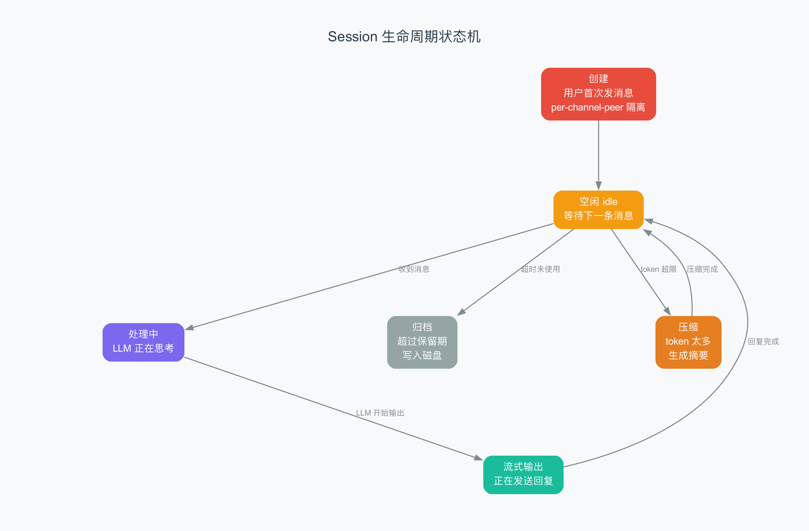

# 第 7 章 Session 管理与持久化

> 每一次对话，都是一份客户档案。OpenClaw 不靠数据库，靠的是一个带锁的 JSON 文件。

## 7.1 从上一章到这里

上一章我们看了 Gateway——消息的"分拣中心"。消息从 Channel 进来，经过 Gateway 的路由、节流、广播，最终交给 Agent 处理。但一个关键问题还没回答：**Agent 处理完消息之后，对话的上下文保存在哪里？**

你打开微信和客服聊天，今天问了一句"我的快递到哪了"，明天又问"能换个地址吗"——客服记得你昨天问过什么，这是因为背后有一套"客户档案"系统。在 OpenClaw 里，这个档案系统就叫 Session（会话）。

如果 Gateway 是餐厅的厨房，Session 就是前台的客户档案柜——每个客人来了，服务员会翻开他专属的那一页，记录他今天点了什么、上次聊到哪、有什么偏好。

## 7.2 Session 是什么

Session 就是一次**持久的对话上下文**（persistent conversation context，即跨多次消息来回仍然保持的记忆）。当用户第一次发消息给 OpenClaw 的 AI 时，系统就会为他创建一个 Session。此后这个用户的所有消息、AI 的回复、调用的工具、产生的事件，统统记录在这个 Session 里。

### Session 隔离：每个用户都有自己的档案

Session 最核心的设计原则是**隔离**——不同用户在不同平台上的对话互不干扰。

想象一家连锁餐厅：同一个顾客在不同分店（WhatsApp、Telegram、Discord）用餐，每家分店有自己的档案；不同顾客在同一家分店用餐，各自也有自己的档案。

在 OpenClaw 源码中，Session 靠一个 **Session Key**（会话键，即用来唯一标识一个会话的字符串）来区分。Session Key 的格式从 `src/routing/session-key.ts` 的 `buildAgentPeerSessionKey` 函数可以清楚看到：

```
agent:{agentId}:{channel}:{accountId}:direct:{peerId}
```

举个例子：

```
agent:main:whatsapp:default:direct:8613800138000
```

这个 Key 由以下部分拼接而成：

| 字段 | 含义 | 示例 |
|------|------|------|
| `agent` | 固定前缀 | - |
| `agentId` | Agent 标识 | `main` |
| `channel` | 消息平台 | `whatsapp` |
| `accountId` | 账号标识 | `default` |
| `direct` | 会话类型（私聊） | `direct` / `group` |
| `peerId` | 用户标识 | `8613800138000` |

### dmScope：控制隔离粒度

不过，并非所有场景都需要最细粒度的隔离。OpenClaw 提供了四种 DM（Direct Message，私信）隔离策略，称为 **dmScope**：

| dmScope 值 | 行为 | Session Key 示例 |
|-------------|------|-----------------|
| `main` | 所有私聊共享一个 Session | `agent:main:main` |
| `per-peer` | 每个用户一个 Session，不区分平台 | `agent:main:direct:8613800138000` |
| `per-channel-peer` | 每个用户在每个平台各一个 Session（默认） | `agent:main:whatsapp:direct:8613800138000` |
| `per-account-channel-peer` | 最细粒度，区分账号 | `agent:main:whatsapp:default:direct:8613800138000` |

默认使用 `per-channel-peer`——这在大多数情况下是最佳选择：同一个人在 WhatsApp 和 Telegram 上和 AI 聊天，会有两份独立的上下文，因为这两个平台的使用场景通常不同。

此外，群聊的 Session Key 格式稍有不同，会使用 `group` 或 `channel` 作为 `peerKind`：

```
agent:main:discord:group:1234567890
```

## 7.3 Session Store 架构

了解了 Session Key 的命名规则，接下来看这些 Session 实际存在哪里。

答案可能让你意外：**一个 JSON 文件**。

没有数据库，没有 Redis。OpenClaw 的 Session Store 就是一个磁盘上的 JSON 文件，路径通常是 `sessions/sessions.json`。这个 JSON 文件长这样：

```json
{
  "agent:main:whatsapp:direct:8613800138000": {
    "sessionId": "a1b2c3d4-e5f6-...",
    "updatedAt": 1712345678000,
    "channel": "whatsapp",
    "deliveryContext": { "channel": "whatsapp", "to": "1234567890" },
    "model": "gpt-4o",
    "modelProvider": "openai",
    "inputTokens": 1500,
    "outputTokens": 800,
    "totalTokens": 2300
  },
  "agent:main:telegram:direct:9876543210": {
    "sessionId": "f6e5d4c3-b2a1-...",
    "updatedAt": 1712345600000,
    ...
  }
}
```

每个顶层 key 就是一个 Session Key，对应的 value 是一个 **SessionEntry**（会话条目，即一条会话的完整元数据记录）。

### 为什么不用数据库？

对于 OpenClaw 的典型部署规模（几十到几百个并发用户），JSON 文件完全够用——简单、可读、易于备份。只有当并发用户数达到数万级别时，才需要考虑数据库。

### SessionEntry 里有什么

`SessionEntry` 包含几十个字段，这里列出最关键的几个：

| 字段 | 类型 | 含义 |
|------|------|------|
| `sessionId` | `string` | 全局唯一 ID（UUID） |
| `updatedAt` | `number` | 最后更新时间（毫秒时间戳） |
| `sessionFile` | `string` | 对话记录文件路径 |
| `channel` | `string` | 来源平台 |
| `deliveryContext` | `object` | 投递上下文（平台、收件人等） |
| `model` | `string` | 当前使用的 AI 模型 |
| `modelProvider` | `string` | 模型提供商 |
| `inputTokens` | `number` | 累计输入 Token 数 |
| `outputTokens` | `number` | 累计输出 Token 数 |
| `totalTokens` | `number` | 累计总 Token 数 |
| `estimatedCostUsd` | `number` | 预估费用（美元） |

一个 SessionEntry 就像一份客户档案卡：上面记着客户是谁、从哪个渠道来的、上次聊到什么时候、花了多少钱。

## 7.4 文件锁与并发控制

既然 Session Store 是一个 JSON 文件，那么问题来了：**如果两个消息同时到达，都要修改同一个文件，怎么办？**

这就像两个人同时想在同一本笔记本上写字——如果不管控，就会互相覆盖。OpenClaw 的解决方案是**文件锁 + 任务队列**。

从 `store.ts` 源码中可以看到，所有对 Session Store 的写操作都经过一个 `withSessionStoreLock` 函数。工作流程如下：

1. **任务入队**：每个写操作被封装成一个任务（task），推入对应文件的队列
2. **依次执行**：队列中的任务按先进先出（FIFO）的顺序执行
3. **文件锁**：执行前获取操作系统级别的文件锁（`.lock` 文件），防止其他进程同时写入
4. **重新读取**：在锁内重新从磁盘读取最新数据，避免覆盖其他任务的修改
5. **写入磁盘**：修改完成后，用原子写入（先写临时文件，再重命名）保存

这个过程可以类比银行的柜台：多个客户排队等候（任务队列），每次只叫一个号（文件锁），柜员会先查最新的余额（重新读取），再办理业务（修改），最后入账（原子写入）。

### 原子写入

`writeTextAtomic` 函数的实现原理是"写入临时文件 → 重命名"。在 Unix 系统上，`rename` 系统调用是原子的——要么成功，要么失败，不会出现写了一半的情况。Windows 上稍复杂，源码中为此加了最多 5 次重试。

## 7.5 Session 生命周期

一个 Session 从创建到最终消失，会经历多个状态阶段。



### Created（创建）

当某个用户第一次发消息给 OpenClaw 时，系统会创建一个新的 SessionEntry。这个过程由 `recordSessionMetaFromInbound` 函数完成——它从入站消息（Inbound Message）中提取元数据，用 `crypto.randomUUID()` 生成唯一的 `sessionId`（UUID，全局唯一标识符，保证不重复——就像身份证号一样），写入 Session Store。

### Active（活跃）

用户持续发消息、AI 持续回复时，Session 处于 Active 状态。每次交互都会更新 `updatedAt` 时间戳和 Token 计量。这是 Session 最常见、最有价值的状态。

### Idle（空闲）

用户一段时间没有发消息，Session 就进入 Idle 状态。虽然没有明确的"状态字段"来标记，但系统通过 `updatedAt` 时间戳来判断：如果当前时间减去 `updatedAt` 超过了配置的 `pruneAfterMs`（默认 30 天），这个 Session 就被视为过期。

### Archived / Deleted（归档 / 删除）

当 Session 被修剪（prune）或因数量上限被移除时，它的对话记录文件不会被立刻删除——而是被移动到归档目录。这是一个贴心的设计：即使 Session 元数据被清理了，历史对话仍然可以通过归档文件找回，就像银行虽然关闭了账户，但交易记录还会保留一段时间。

## 7.6 Transcript 事件持久化

Session Store 保存的是会话的**元数据**（谁、什么时候、用了什么模型、花了多少 Token）。而实际对话的**内容**——用户说了什么、AI 回复了什么、调用了哪些工具——保存在另一个地方：**Transcript 文件**。

Transcript（对话记录）以 JSON Lines 格式（每行一个 JSON 对象）存储在独立的文件中，路径由 `sessionFile` 字段指定。

从 `transcript.ts` 源码可以看到，每条消息记录包含 `role`（角色）、`content`（内容）、`usage`（Token 用量）、`timestamp`（时间戳）等字段，格式与 OpenAI API 的消息结构兼容。

Transcript 的作用是双重的：

1. **为 AI 提供上下文**：下一轮对话时，系统会从 Transcript 文件中读取历史消息，组装成 AI 能理解的上下文
2. **为人类提供审计**：运维人员可以打开 Transcript 文件，查看完整的对话历史

此外，Transcript 还支持**幂等性**（idempotency，即同一操作执行多次结果不变）。如果同一条消息因为网络重传被记录了两次，`idempotencyKey` 字段能确保它只被写入一次。

## 7.7 磁盘预算与修剪

随着时间的推移，Session 文件会越来越大，Transcript 文件也会越来越多。如果不加管控，磁盘空间终将耗尽。

OpenClaw 提供了三层磁盘空间管理机制：

### 第一层：修剪过期 Session

核心逻辑很简单——计算一个截止时间，把所有 `updatedAt` 早于截止时间的 Session 删掉：

```
cutoffMs = 当前时间 - maxAgeMs（默认 30 天）
删除所有 updatedAt < cutoffMs 的条目
```

这就像图书馆定期清理多年没人借阅的书——释放空间给新的书籍。

### 第二层：数量上限

默认最多保留 500 个 Session。超出时，按 `updatedAt` 降序排列，移除最久没活跃的。这就像仓库只能放 500 箱货，满了就把最久没动过的箱子清掉。

### 第三层：磁盘预算

如果配置了 `maxDiskBytes`（最大磁盘字节数），系统会计算 sessions 目录下所有文件的总大小。如果超出预算：

1. 先删除已归档的旧文件（最久没被访问的优先）
2. 如果还不够，删除最旧的 SessionEntry 及其关联的 Transcript 文件
3. 直到总大小降到 **高水位线**（high water mark，即目标清理水位，默认为预算的 80%）以下

还有一个特别的保护：**活跃 Session 不会被清理**。系统会跳过当前正在使用的 Session，确保不会因为磁盘清理把正在进行的对话截断。

### 文件轮转

当 `sessions.json` 本身超过 10MB 时，会被重命名为 `sessions.json.bak.{timestamp}` 归档，最多保留 3 个备份。这是一个保险机制——即使主文件损坏，也能从备份恢复。

## 7.8 缓存机制

每次读写 Session 都要解析 JSON 文件，这在高并发场景下会成为瓶颈。为此，OpenClaw 在 `store-cache.ts` 中实现了一个**内存缓存层**。

缓存的核心是一个带 TTL（Time To Live，存活时间）的 Map，默认 45 秒过期。工作方式：

1. **读缓存**：加载 Session Store 时，先检查内存中有没有缓存、文件的修改时间是否匹配。如果缓存有效，直接返回，跳过磁盘读取和 JSON 解析
2. **写缓存**：写入磁盘后，同时更新内存缓存
3. **缓存失效**：如果文件的修改时间（`mtimeMs`）或大小（`sizeBytes`）与缓存不一致，立即丢弃缓存，重新从磁盘加载
4. **TTL 过期**：缓存默认 45 秒后自动失效，确保不会长时间使用过时的数据

此外，系统还会缓存 JSON 序列化后的字符串——如果两次写入之间数据没有变化，直接跳过写入，省掉磁盘 I/O。

### warn 模式

维护模式（maintenance mode）支持 **warn** 和 **enforce** 两种模式：

- **warn 模式**（默认）：只记录日志警告，不实际执行清理。适合刚部署时观察行为
- **enforce 模式**：真正执行修剪、上限、磁盘预算清理

这让运维人员可以先在 warn 模式下观察几天，确认清理策略符合预期，再切换到 enforce 模式。

## 7.9 小结

这章我们看了 OpenClaw 的 Session 管理系统——一个基于 JSON 文件的、精巧的对话上下文存储方案：

1. **Session Key**：由 agentId、channel、peerId 等组合而成，支持四种 DM 隔离粒度
2. **Session Store**：一个 JSON 文件存储所有会话的元数据，简单、可读、易调试
3. **并发控制**：文件锁 + 内存任务队列，保证并发写入不会互相覆盖
4. **生命周期管理**：Session 从创建到活跃、空闲、归档，每个阶段都有对应的处理逻辑
5. **Transcript 持久化**：对话内容以 JSON Lines 格式独立存储，支持幂等写入
6. **磁盘管理**：三层防护——修剪过期 Session、数量上限、磁盘预算，确保存储不会失控
7. **内存缓存**：45 秒 TTL 的缓存层，减少磁盘 I/O，提升读取性能
8. **渐进式维护**：warn 模式让运维人员可以先观察再执行

下一章，我们将看看 OpenClaw 的 Skill 和 Tool 系统——AI 怎么学会使用各种工具来完成复杂任务。

---

## 术语速查表

| 术语 | 解释 |
|------|------|
| Atomic write | 原子写入，通过"写临时文件再重命名"保证数据不会写到一半 |
| Cache invalidation | 缓存失效，当源数据变化时让缓存作废，确保读到最新数据 |
| Capping | 数量上限，限制最多保留多少条 Session 记录 |
| dmScope | 私聊隔离策略，控制不同用户的 Session 如何分组 |
| FIFO | First In First Out，先进先出，先排队的任务先执行 |
| File lock | 文件锁，防止多个进程同时修改同一个文件 |
| High water mark | 高水位线，磁盘清理的目标水位，通常设为预算的 80% |
| Idempotency | 幂等性，同一操作执行多次结果不变 |
| JSON Lines | 每行一个 JSON 对象的文件格式，适合逐条追加写入 |
| Pruning | 修剪，移除过期或超限的 Session 记录 |
| Rotation | 文件轮转，当文件过大时归档旧文件，创建新文件 |
| Session Key | 会话键，唯一标识一个会话的字符串 |
| SessionEntry | 会话条目，一条会话的完整元数据记录 |
| Task queue | 任务队列，按先进先出顺序依次执行写操作 |
| TTL | Time To Live，存活时间，超过后缓存自动失效 |
| Transcript | 对话记录，保存每轮对话内容的独立文件 |
| UUID | 全局唯一标识符，保证每个 Session 的 ID 不会重复 |
