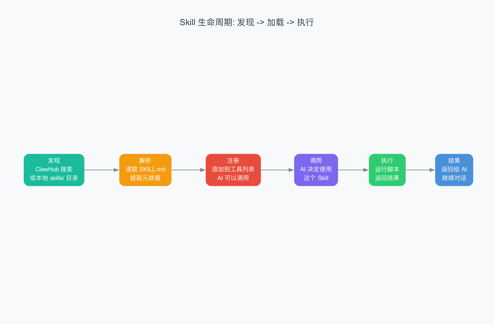

# 第 8 章 Skill 与工具系统

> 50 多个"瑞士军刀刀片"，AI 想用哪个就装哪个。

## 8.1 从上一章到这里

上一章我们讲了 Session 管理——AI 怎么记住"刚才聊了什么"。但光有记忆还不够。如果你的 AI 助手只会说话，不会干活，那它就像一个只会纸上谈兵的军师——出主意很在行，但什么也执行不了。

这一章，我们来看 OpenClaw 是怎么给 AI "装上手"的。答案就是 **Skill 系统**（技能系统，即一组可被 AI 调用的能力模块，每个模块封装了特定的工具或服务操作）。

## 8.2 瑞士军刀的比喻

想象你有一把瑞士军刀。刀身本身什么都能做一点——削苹果、拧螺丝、开瓶盖。但如果要锯木头呢？你需要换上一个锯齿刀片。要剪电线呢？换上一个钳子刀片。

OpenClaw 的 AI 就是那把"刀身"，Skill 就是那些"刀片"。AI 本身只能思考和说话，但每装上一个 Skill，它就多了一项能力：

- 装上 **weather** Skill → AI 能查天气
- 装上 **github** Skill → AI 能管理 GitHub Issues 和 PR
- 装上 **slack** Skill → AI 能在 Slack 里发消息、Pin 消息
- 装上 **coding-agent** Skill → AI 能调用 Codex 或 Claude Code 写代码

OpenClaw 内置了 50 多个 Skill，涵盖天气、邮件、笔记、音乐、日历、代码、项目管理等方方面面。你不需要一次性全装上——AI 会根据用户的问题，自动选择合适的 Skill 来用。

## 8.3 SKILL.md：一张"技能说明书"

每个 Skill 的核心是一个叫 **SKILL.md** 的 Markdown 文件。就像产品说明书一样，它告诉 AI：

- 这个 Skill 叫什么
- 什么时候该用它、什么时候不该用
- 它需要什么前置条件（比如需要安装某个命令行工具）
- 它支持哪些操作、每个操作的具体命令是什么

让我们看两个真实的例子。

### 天气 Skill

```yaml
---
name: weather
description: "Get current weather and forecasts via wttr.in or Open-Meteo.
  Use when: user asks about weather, temperature, or forecasts.
  NOT for: historical weather data, severe weather alerts."
metadata:
  openclaw:
    emoji: "☔"
    requires: { bins: ["curl"] }
    install:
      - id: brew
        kind: brew
        formula: curl
        bins: ["curl"]
        label: "Install curl (brew)"
---
```

这段 YAML（YAML Ain't Markup Language，一种人类可读的数据序列化格式）是 SKILL.md 的"头部"（frontmatter），包含三个关键字段：

1. **name**：Skill 的唯一标识符
2. **description**：告诉 AI "什么时候用我、什么时候别用我"——这是 AI 自动选择 Skill 的依据
3. **metadata**：技术元数据——需要一个 emoji 图标、依赖什么二进制工具（`bins`）、怎么安装

头部之后是 Markdown 正文，详细列出各种命令的用法：

```bash
# 当前天气
curl "wttr.in/London?format=3"

# 三天预报
curl "wttr.in/London"

# JSON 格式输出
curl "wttr.in/London?format=j1"
```

AI 读到这些内容后，就知道：当用户问"北京天气怎么样"时，它应该运行 `curl "wttr.in/Beijing?format=3"` 来获取答案。

### GitHub Skill

```yaml
---
name: github
description: "GitHub operations via gh CLI: issues, PRs, CI runs,
  code review, API queries. Use when: checking PR status or CI,
  creating/commenting on issues."
metadata:
  openclaw:
    emoji: "🐙"
    requires: { bins: ["gh"] }
---
```

GitHub Skill 更复杂一些——它支持查看 PR 状态、管理 Issue、查看 CI 运行日志、API 查询等十几种操作。SKILL.md 里为每种操作都写了示例命令：

```bash
# 列出 PR
gh pr list --repo owner/repo

# 查看 CI 状态
gh pr checks 55 --repo owner/repo

# 创建 Issue
gh issue create --title "Bug: something broken" --body "Details..."
```

## 8.4 Skill 生命周期：发现 → 解析 → 注册 → 调用 → 执行

一个 Skill 从"躺在磁盘上"到"被 AI 使用"，要经历五个阶段。



### 第 1 步：发现（Discovery）

Gateway 启动时，扫描 `skills/` 目录下的所有子文件夹。每个包含 `SKILL.md` 文件的子文件夹就是一个 Skill。OpenClaw 内置了 50 多个，分布在各自的目录中：

```
skills/
├── weather/SKILL.md
├── github/SKILL.md
├── slack/SKILL.md
├── coding-agent/SKILL.md
├── notion/SKILL.md
├── spotify-player/SKILL.md
├── discord/SKILL.md
├── ...（共 50+ 个）
```

### 第 2 步：解析（Parse）

读取每个 SKILL.md 文件，解析 YAML 头部，提取：
- Skill 名称和描述
- 依赖条件（需要哪些命令行工具）
- 安装方式
- 正文中的命令模板

### 第 3 步：注册（Register）

将解析出的 Skill 信息注册到 AI 的 System Prompt 中。这样 AI 在思考"我该用什么工具"时，就能看到所有可用 Skill 的列表和说明。

### 第 4 步：调用（Invoke）

当 AI 决定使用某个 Skill 时，它会生成一个"工具调用"请求。比如用户问"伦敦天气怎么样"，AI 会选择调用 weather Skill。

这个调用在 `tools-invoke-http.ts` 中经过了完整的安全检查流水线：

```typescript
// 1. 解析工具名称
const toolName = body.tool.trim();

// 2. 解析工具策略（谁有权限用什么工具）
const globalPolicy = ...;  // 全局策略
const agentPolicy = ...;   // Agent 策略
const profilePolicy = ...; // 配置文件策略
const groupPolicy = ...;   // 分组策略

// 3. 构建工具列表（核心 + 插件工具）
const allTools = createOpenClawTools({ config, pluginToolAllowlist, ... });

// 4. 通过安全策略管道过滤
const filtered = applyToolPolicyPipeline({ tools: allTools, steps: [...] });

// 5. Gateway HTTP 特定的拒绝列表
const gatewayDenySet = new Set(DEFAULT_GATEWAY_HTTP_TOOL_DENY);
const finalTools = filtered.filter(t => !gatewayDenySet.has(t.name));
```

这段代码展示了一个多层安全过滤器：全局策略 → Agent 策略 → 配置文件策略 → 分组策略 → 子 Agent 策略 → Gateway HTTP 拒绝列表。只有通过所有过滤器的工具才能被执行。

### 第 5 步：执行（Execute）

工具最终通过沙箱（sandbox，即一个受限的执行环境，防止工具操作影响宿主系统）执行。执行结果返回给 AI，AI 将结果整理后回复用户。

## 8.5 ClawHub：Skill 的"应用商店"

你可能会想：50 多个内置 Skill 够用了，但如果我需要更多呢？比如，我需要一个能操作 PostgreSQL 数据库的 Skill，或者一个能控制智能家居的 Skill。

这就是 **ClawHub** 的用途。ClawHub 是 OpenClaw 的"应用商店"——一个在线的 Skill 注册中心，任何人都可以发布和下载 Skill。

```bash
# 安装 ClawHub CLI
npm i -g clawhub

# 搜索 Skill
clawhub search "postgres backups"

# 安装 Skill
clawhub install my-skill

# 更新 Skill
clawhub update --all

# 发布自己写的 Skill
clawhub publish ./my-skill --slug my-skill --name "My Skill" --version 1.0.0
```

ClawHub Skill 的格式和内置 Skill 完全一样——一个 SKILL.md 文件加可选的脚本和参考文档。这意味着：

1. 你可以从 ClawHub 安装别人写好的 Skill
2. 你可以自己写 Skill，发布到 ClawHub 分享给别人
3. 安装后的第三方 Skill 和内置 Skill 用起来完全一样

ClawHub 的设计理念很接近手机应用商店——内置的 Skill 就像预装应用，ClawHub 上的就像第三方应用。AI 不知道也不关心一个 Skill 是内置的还是从 ClawHub 下载的，它只看 SKILL.md 里的描述来决定用不用。

## 8.6 MCP 协议：让外部工具和 AI 对话

Skill 系统解决的是"AI 能做什么"的问题，但还有一个问题：**外部工具怎么和 AI 通信**？

比如，Claude Code 想通过 OpenClaw 读取消息、发送消息、查看会话列表——这些操作需要一个标准的通信协议。这个协议就是 **MCP**（Model Context Protocol，模型上下文协议，一个让 AI 模型和外部工具互操作的开放标准）。

OpenClaw 在 `channel-server.ts` 中实现了一个完整的 MCP 服务器。它提供了以下工具：

| MCP 工具 | 功能 |
|-----------|------|
| `conversations_list` | 列出所有会话 |
| `conversation_get` | 获取单个会话详情 |
| `messages_read` | 读取会话中的消息 |
| `messages_send` | 发送消息到会话 |
| `attachments_fetch` | 获取消息中的附件 |
| `events_poll` | 轮询新事件 |
| `events_wait` | 等待下一个事件 |
| `permissions_list_open` | 列出待审批的权限请求 |
| `permissions_respond` | 响应权限请求 |

整个架构像一个"翻译官"——MCP 服务器一端连接 Gateway（通过 WebSocket），另一端暴露标准 MCP 工具接口。Claude Code 或其他 MCP 客户端连接后，就能用标准方式操作 OpenClaw 的消息和会话。

```typescript
// MCP 服务器注册工具的方式
server.tool(
  "conversations_list",
  "List OpenClaw channel-backed conversations.",
  {
    limit: z.number().int().min(1).max(500).optional(),
    search: z.string().optional(),
    channel: z.string().optional(),
  },
  async (args) => {
    const conversations = await bridge.listConversations(args);
    return { structuredContent: { conversations } };
  }
);
```

这段代码展示了一个典型的 MCP 工具注册：定义工具名称、描述、参数 schema（用 Zod 验证库描述），然后提供异步执行函数。外部客户端调用 `conversations_list` 时，MCP 服务器会通过内部的 `bridge` 对象向 Gateway 请求数据，再把结果格式化后返回。

MCP 服务器还实现了一个精巧的**事件队列**（event queue）机制。Gateway 推送的所有事件（新消息、权限请求等）都被放入一个内存队列，MCP 客户端可以通过 `events_poll` 轮询，也可以通过 `events_wait` 长等待：

```typescript
// 轮询：立刻返回已有的事件
pollEvents(filter: WaitFilter, limit = 20): { events: QueueEvent[]; nextCursor: number }

// 等待：阻塞直到有新事件或超时
async waitForEvent(filter: WaitFilter, timeoutMs = 30_000): Promise<QueueEvent | null>
```

队列有大小限制（1000 个事件），超出的旧事件会被丢弃。等待者（waiter）有超时机制，默认 30 秒。

## 8.7 工具沙箱：安全第一

AI 能执行命令是好事，但也带来了安全隐患。如果用户让 AI "删除所有文件"，AI 真的去删了怎么办？

OpenClaw 的工具执行是在**沙箱**中进行的。沙箱就像一个透明的玻璃房——AI 可以在里面看到一切、操作一些东西，但它的影响范围被严格控制。

从 `tools-invoke-http.ts` 中可以看到多层安全机制：

1. **工具策略流水线**（Tool Policy Pipeline）：逐层过滤可用的工具列表
2. **拒绝列表**（Deny List）：一组被禁止通过 HTTP 调用的危险工具
3. **权限钩子**（Before Tool Call Hook）：在实际执行前检查是否被阻止
4. **执行错误处理**：工具执行失败不会影响 Gateway 的稳定性

```typescript
// 权限钩子：在实际执行前检查
const hookResult = await runBeforeToolCallHook({
  toolName, params: toolArgs, toolCallId,
  ctx: { agentId, sessionKey, loopDetection: ... }
});
if (hookResult.blocked) {
  // 被阻止了，返回 403
  return sendJson(res, 403, { error: { message: hookResult.reason } });
}
// 没被阻止，执行工具
const result = await tool.execute(toolCallId, hookResult.params);
```

## 8.8 实际例子：从查天气到写代码

让我们走一个完整的流程，看看 Skill 系统是怎么协作的。

**场景**：用户在 Telegram 上问"北京今天天气怎么样？明天帮我查一下 GitHub 上 openclaw/openclaw 的 open issue 有多少。"

### Step 1：AI 分析意图

AI 读到用户的消息，分析出两个意图：
1. 查北京天气 → 需要 weather Skill
2. 查 GitHub Issues → 需要 github Skill

### Step 2：选择 Skill

AI 查看 System Prompt 中注册的 Skill 列表，找到 weather 和 github 的描述，确认它们适合这两个任务。

### Step 3：生成工具调用

AI 生成两个工具调用：

```json
[
  { "tool": "bash", "command": "curl -s 'wttr.in/Beijing?format=3'" },
  { "tool": "bash", "command": "gh issue list --repo openclaw/openclaw --state open --json number --jq length" }
]
```

### Step 4：沙箱执行

工具调用经过安全策略检查，确认没有危险操作，然后在沙箱中执行。

### Step 5：结果返回

```json
[
  { "result": "Beijing: ☀️ +22°C" },
  { "result": "47" }
]
```

### Step 6：AI 整理回复

AI 把两个结果整合成自然语言：

> 北京今天晴天，气温 22 度。明天帮你查了，openclaw/openclaw 仓库目前有 47 个 open issue。

整个过程用户只需要说一句话，AI 自动选择了合适的 Skill、生成了正确的命令、在安全环境中执行、整理了结果。

## 8.9 和 Claude Code 工具系统的对比

如果你读过 Claude Code 的教程，会发现两者有相似之处：

| 方面 | Claude Code | OpenClaw |
|------|-------------|----------|
| **工具发现** | 代码中静态定义 | SKILL.md 动态发现 |
| **工具格式** | TypeScript 函数 | Markdown + 命令行脚本 |
| **外部扩展** | MCP 协议 | ClawHub + MCP 协议 |
| **安全机制** | 权限系统（allow/deny） | 多层策略流水线 + 沙箱 |
| **用户贡献** | 无官方市场 | ClawHub 应用商店 |

关键区别在于**开放性**。Claude Code 的工具主要面向编程场景，内置且固定。OpenClaw 的 Skill 系统面向生活和工作中的各种场景，任何人都可以写一个新的 Skill 发布到 ClawHub。这就像 iPhone 预装应用 vs App Store 的关系。

## 8.10 小结

这章我们学习了：

1. **Skill 系统**是 OpenClaw 给 AI "装上手"的方式——50 多个内置 Skill，像瑞士军刀刀片
2. **SKILL.md** 是每个 Skill 的"说明书"，告诉 AI 何时使用、怎么使用
3. **Skill 生命周期**：发现 → 解析 → 注册 → 调用 → 执行，五步完成从文件到能力
4. **ClawHub** 是 Skill 的"应用商店"，支持搜索、安装、更新、发布
5. **MCP 协议**让外部工具和 AI 标准化通信，`channel-server.ts` 实现了完整的 MCP 服务器
6. **沙箱执行**确保 AI 的操作被安全控制，多层策略流水线防止危险操作

下一章，我们将深入 Hook 系统——看 OpenClaw 是怎么实现"如果 X 发生了，就自动做 Y"的事件驱动自动化的。

---

## 术语速查表

| 术语 | 解释 |
|------|------|
| ClawHub | OpenClaw 的在线 Skill 注册中心，类似应用商店 |
| Event queue | 事件队列，存储待处理事件的内存缓冲区 |
| Frontmatter | SKILL.md 文件头部的 YAML 元数据块 |
| MCP | Model Context Protocol，模型上下文协议，AI 与外部工具互操作的开放标准 |
| Sandbox | 沙箱，限制工具执行影响范围的安全环境 |
| Skill | OpenClaw 中的能力模块，每个封装了特定工具或服务的操作 |
| SKILL.md | Skill 的定义文件，包含名称、描述、命令模板等信息 |
| Tool Policy Pipeline | 工具策略流水线，多层过滤器决定哪些工具可以被执行 |
| Waiter | 等待者，MCP 事件队列中注册的异步回调，用于通知新事件到达 |
| Zod | TypeScript 运行时类型验证库，用于校验工具参数 |
