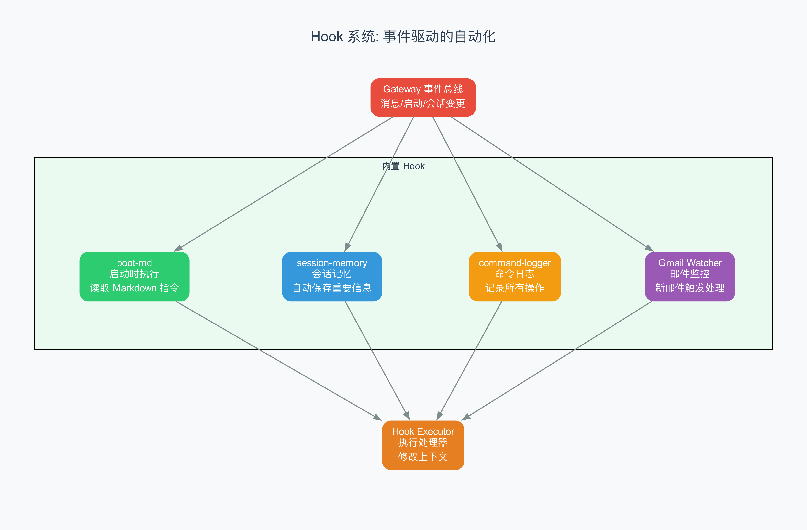

# 第 9 章 Hook 系统与事件自动化

> "门开了，灯就亮"——智能家居的逻辑，也能用在 AI 助手上。

## 9.1 从上一章到这里

上一章我们看了 Skill 系统——AI 怎么"学会"使用各种工具。但有些事情不需要 AI 主动去做，而是应该在某个事件发生时自动触发。比如：

- Gateway 启动时，自动执行 BOOT.md 里的初始化指令
- 用户执行 `/new` 命令时，自动把旧会话的摘要保存到记忆文件
- 每一条命令，都自动记录到审计日志里

这些"当 X 发生时，自动做 Y"的逻辑，就是 **Hook 系统**（钩子系统，一种事件驱动的自动化机制，允许在特定事件发生时执行自定义逻辑）的工作。

## 9.2 智能家居的比喻

如果你用过智能家居，一定对"自动化"不陌生：

- **门打开了** → 自动开灯
- **温度超过 28 度** → 自动开空调
- **有人按门铃** → 手机推送通知
- **每天早上 7 点** → 自动拉窗帘

OpenClaw 的 Hook 系统做的就是同样的事情，只不过触发条件和动作都是 AI 系统内部的：

- **Gateway 启动了** → 自动执行 BOOT.md（boot-md Hook）
- **用户执行 `/new`** → 自动保存会话记忆（session-memory Hook）
- **有命令执行了** → 自动写入审计日志（command-logger Hook）
- **收到新邮件了** → 自动转发给 AI 处理（Gmail Watcher）

## 9.3 三层管道：生产者 → 事件总线 → 执行器

Hook 系统的核心是一个三层管道架构。



### 第一层：事件生产者（Event Producers）

系统中的各个模块在运行过程中产生事件。OpenClaw 定义了五种事件类型：

| 事件类型 | 说明 | 示例 |
|----------|------|------|
| `command` | 用户命令事件 | `/new`、`/reset`、`/stop` |
| `session` | 会话生命周期事件 | 会话创建、更新、删除 |
| `agent` | Agent 事件 | Agent 启动、Bootstrap |
| `gateway` | Gateway 生命周期事件 | Gateway 启动、关闭 |
| `message` | 消息事件 | 消息收到、消息发送、消息转录 |

每种事件类型下面还有具体的 **action**（动作）。比如 `command` 类型下面有 `new`、`reset`、`stop` 等 action；`message` 类型下面有 `received`、`sent`、`transcribed` 等 action。

事件的完整标识是 `type:action` 的组合，比如 `command:new`、`gateway:startup`、`message:received`。

### 第二层：事件总线（Event Bus）

事件总线是整个 Hook 系统的核心枢纽。它的实现在 `internal-hooks.ts` 中，核心是一个全局单例的注册表：

```typescript
// 全局单例注册表——用 Symbol.for 确保跨模块共享
const INTERNAL_HOOK_HANDLERS_KEY = Symbol.for("openclaw.internalHookHandlers");
const handlers = resolveGlobalSingleton<Map<string, InternalHookHandler[]>>(
  INTERNAL_HOOK_HANDLERS_KEY,
  () => new Map<string, InternalHookHandler[]>(),
);
```

为什么用全局单例？因为 OpenClaw 的代码可能被打包器（bundler，将多个源文件合并的工具）拆分成多个 chunk。如果不用全局单例，不同 chunk 中的 `registerHook` 和 `triggerHook` 就会使用不同的 Map，导致 Hook 注册了但触发不到。

注册和触发的过程是这样的：

```typescript
// 注册：监听所有 command 事件
registerHook('command', async (event) => {
  console.log('Command:', event.action);
});

// 注册：只监听 /new 命令
registerHook('command:new', async (event) => {
  await saveSessionToMemory(event);
});

// 触发：当 /new 命令发生时
triggerHook(createHookEvent('command', 'new', sessionKey, context));
```

`triggerHook` 会同时调用两种处理器：
1. 监听 `command` 的处理器（通用）
2. 监听 `command:new` 的处理器（特定）

而且处理器是按注册顺序依次调用的，某个处理器出错不会阻止后续处理器运行。

### 第三层：Hook 执行器（Hook Executor）

每个注册的处理器是一个异步函数，接收事件对象，执行特定逻辑：

```typescript
type InternalHookHandler = (event: InternalHookEvent) => Promise<void> | void;

type InternalHookEvent = {
  type: "command" | "session" | "agent" | "gateway" | "message";
  action: string;
  sessionKey: string;
  context: Record<string, unknown>;
  timestamp: Date;
  messages: string[];  // 处理器可以往这里推送消息
};
```

## 9.4 四个内置 Hook

OpenClaw 自带了四个内置 Hook，每个都有各自的 HOOK.md 定义文件和 handler.ts 实现文件。

### boot-md：启动自检清单

**触发时机**：`gateway:startup`（Gateway 启动时）

**作用**：遍历所有配置的 Agent，执行每个 Agent workspace 中的 BOOT.md 文件。

```typescript
const runBootChecklist: HookHandler = async (event) => {
  if (!isGatewayStartupEvent(event)) return;

  const cfg = event.context.cfg;
  const agentIds = listAgentIds(cfg);

  for (const agentId of agentIds) {
    const workspaceDir = resolveAgentWorkspaceDir(cfg, agentId);
    const result = await runBootOnce({ cfg, workspaceDir, agentId });
    // 失败了不中断，继续处理下一个 Agent
  }
};
```

就像你每天早上到办公室，先检查一遍"今天要做的事"清单。BOOT.md 就是 Agent 的"每日清单"——里面可以写"检查未读邮件"、"同步日历"、"提醒今天有会议"等。Gateway 启动时，boot-md Hook 会自动帮你跑完这个清单。

### session-memory：会话记忆自动保存

**触发时机**：`command:new` 和 `command:reset`（用户开始新会话时）

**作用**：在旧会话被丢弃之前，自动提取对话摘要，保存到 `memory/` 目录下的 Markdown 文件中。

```typescript
const saveSessionToMemory: HookHandler = async (event) => {
  if (event.type !== "command" || !(event.action === "new" || event.action === "reset")) return;

  // 1. 找到旧会话的 transcript 文件
  const sessionContent = await getRecentSessionContentWithResetFallback(sessionFile, messageCount);

  // 2. 用 LLM 生成描述性文件名（比如 "2026-04-02-api-design.md"）
  const slug = await generateSlugViaLLM({ sessionContent, cfg });

  // 3. 写入 memory 目录
  const filename = `${dateStr}-${slug}.md`;
  await writeFileWithinRoot({ rootDir: memoryDir, relativePath: filename, data: entry });
};
```

这是第 2 章讲的"外部记忆"原语的具体实现之一。AI 的短期记忆（上下文窗口）是有限的，当用户执行 `/new` 开始新会话时，旧的短期记忆会被清空。session-memory Hook 在清空之前把重要内容"转录"到长期记忆中，这样 AI 在未来的会话中就能回溯之前聊过什么。

生成的文件名很智能——默认用 LLM 根据对话内容生成一个描述性 slug。比如你聊了一个下午的 API 设计，文件名可能是 `2026-04-02-api-design.md`；如果 LLM 不可用，就退回到时间戳命名 `2026-04-02-1430.md`。

### command-logger：命令审计日志

**触发时机**：`command`（所有命令事件）

**作用**：将每条命令的详情追加写入日志文件。

```typescript
const logCommand: HookHandler = async (event) => {
  if (event.type !== "command") return;

  const logLine = JSON.stringify({
    timestamp: event.timestamp.toISOString(),
    action: event.action,
    sessionKey: event.sessionKey,
    senderId: event.context.senderId ?? "unknown",
    source: event.context.commandSource ?? "unknown",
  }) + "\n";

  await fs.appendFile(logFile, logLine, "utf-8");
};
```

日志格式是 JSONL（JSON Lines，每行一个 JSON 对象的日志格式），方便用 `jq` 等工具分析：

```json
{"timestamp":"2026-04-02T14:30:00.000Z","action":"new","sessionKey":"agent:main:main","senderId":"+1234567890","source":"telegram"}
{"timestamp":"2026-04-02T15:45:22.000Z","action":"stop","sessionKey":"agent:main:main","senderId":"user@example.com","source":"whatsapp"}
```

### bootstrap-extra-files：启动额外文件处理

**触发时机**：`agent:bootstrap`（Agent Bootstrap 时）

**作用**：处理 Agent workspace 中的额外启动文件。

## 9.5 Hook 的安装、加载与策略

Hook 不是写好就能用的——它要经过一系列检查才能被加载。

### HOOK.md：Hook 的"身份证"

每个 Hook 目录下都有一个 HOOK.md 文件，定义了 Hook 的元数据：

```yaml
---
name: session-memory
description: "Save session context to memory when /new or /reset"
metadata:
  openclaw:
    emoji: "💾"
    events: ["command:new", "command:reset"]
    requires: { config: ["workspace.dir"] }
    install:
      - id: bundled
        kind: bundled
        label: "Bundled with OpenClaw"
---
```

关键字段：
- **events**：这个 Hook 监听哪些事件
- **requires**：前置条件（需要什么配置、什么命令行工具）
- **install**：安装方式

### Hook 来源与优先级

Hook 有四种来源，各有不同的优先级和信任级别：

| 来源 | 优先级 | 默认启用 | 说明 |
|------|--------|----------|------|
| `openclaw-bundled` | 10（最低） | 是 | 随 OpenClaw 一起发布的内置 Hook |
| `openclaw-plugin` | 20 | 是 | 通过插件系统安装的 Hook |
| `openclaw-managed` | 30 | 是 | 通过 ClawHub 安装的 Hook |
| `openclaw-workspace` | 40（最高） | 否 | 用户在工作目录下自定义的 Hook |

优先级决定了冲突时的覆盖规则：高优先级的 Hook 可以覆盖低优先级的同名 Hook。比如，你可以在工作目录下写一个自定义的 `session-memory` Hook，它会覆盖内置版本。

值得注意的是 `openclaw-workspace` 默认不启用——因为它是用户自己写的代码，直接运行在 Gateway 进程中，需要用户显式确认信任。

### 加载流程

`loader.ts` 中的 `loadInternalHooks` 函数负责加载所有 Hook：

```
1. 检查 hooks.internal.enabled 是否为 true
2. 扫描 Hook 目录（bundled、managed、workspace）
3. 过滤：检查每个 Hook 的前置条件是否满足
4. 安全检查：验证 handler 文件路径在允许范围内
5. 动态导入：import() handler 模块
6. 注册：为 metadata.events 中的每个事件注册处理器
```

加载过程中的安全检查特别重要。OpenClaw 会对 Hook 的 handler 文件路径做 **boundary check**（边界检查，确保文件路径在允许的根目录范围内，防止路径遍历攻击）：

```typescript
const opened = await openBoundaryFile({
  absolutePath: entry.hook.handlerPath,
  rootPath: hookBaseDir,
  boundaryLabel: "hook directory",
});
if (!opened.ok) {
  log.error(`Hook handler path fails boundary checks`);
  continue;
}
```

## 9.6 Gmail Watcher：邮件自动化的完整案例

内置 Hook 之外，OpenClaw 还有一个更复杂的自动化组件：**Gmail Watcher**（Gmail 监控器）。它不是简单的 Hook，而是一个常驻后台的服务进程。

整个流程是这样的：

1. **注册监控**：调用 `gog gmail watch start`，向 Gmail API 注册一个 Pub/Sub 推送订阅
2. **启动服务**：`spawn` 一个 `gog gmail watch serve` 子进程，监听 Gmail 推送
3. **自动续期**：设置定时器，每隔 `renewEveryMinutes` 分钟续期一次监控
4. **异常恢复**：如果子进程崩溃，5 秒后自动重启

```typescript
child.on("exit", (code, signal) => {
  if (shuttingDown) return;
  if (addressInUse) {
    // 端口被占用，可能是另一个实例在运行
    log.warn("Another watcher is likely running. Stopping restarts.");
    return;
  }
  log.warn(`gog exited (code=${code}); restarting in 5s`);
  setTimeout(() => {
    if (!shuttingDown && currentConfig) {
      watcherProcess = spawnGogServe(currentConfig);
    }
  }, 5000);
});
```

Gmail Watcher 还集成了 Tailscale（一种零配置的 VPN 工具）——如果你的 Gateway 不在公网上，Gmail 的推送通知需要一个可达的端点，Tailscale 可以自动帮你搞定。

## 9.7 自动回复系统：消息驱动的自动化

除了 Hook 和 Gmail Watcher，OpenClaw 还有一个**自动回复系统**（Auto-Reply System），它让 AI 能自动回复收到的消息。

自动回复系统的核心是 `dispatch.ts` 中的 `dispatchInboundMessage` 函数。当一条消息到达时：

1. **上下文整理**：把消息的发送者、内容、渠道等信息整理成统一格式
2. **回复派发器创建**：创建一个带"打字中"状态的回复派发器
3. **配置驱动回复**：根据配置决定怎么回复——是用 AI 生成回复，还是用预设模板
4. **流式发送**：回复内容一个片段一个片段地发送，模拟"打字"效果

```typescript
export async function dispatchInboundMessage(params: {
  ctx: MsgContext;
  cfg: OpenClawConfig;
  dispatcher: ReplyDispatcher;
}): Promise<DispatchInboundResult> {
  const finalized = finalizeInboundContext(params.ctx);
  return await withReplyDispatcher({
    dispatcher: params.dispatcher,
    run: () => dispatchReplyFromConfig({ ctx: finalized, cfg: params.cfg, dispatcher }),
  });
}
```

自动回复系统是 OpenClaw "自主触发"原语的体现——AI 不需要人类主动发消息才会行动，它可以在收到邮件、定时器到期、外部 Webhook 等各种触发条件下自动回复。

## 9.8 Cron 定时任务：时间驱动的自动化

最后，OpenClaw 还内置了一个 **Cron 服务**（定时任务服务，类似 Linux 的 cron，按时间表自动执行任务）。

Cron 服务的实现在 `src/cron/service.ts` 中，提供了完整的 CRUD 操作：

```typescript
class CronService {
  async start()           // 启动服务
  async stop()            // 停止服务
  async list()            // 列出所有任务
  async add(input)        // 添加任务
  async update(id, patch) // 更新任务
  async remove(id)        // 删除任务
  async run(id, mode)     // 手动触发任务
  wake(opts)              // 立刻唤醒（用于外部触发）
}
```

你可以设置各种定时任务：

- **每天早上 8 点**：总结昨天的邮件
- **每周一 9 点**：生成上周的项目进度报告
- **每小时**：检查 CI 是否有新的失败

Cron 任务触发时，会创建一个隔离的 Agent 会话（isolated agent session），在独立的上下文中运行，不会干扰正在进行的对话。

## 9.9 完整的事件自动化全景

把所有这些放在一起，OpenClaw 的事件自动化体系是一个完整的金字塔：

```
              ┌─────────────┐
              │ Cron 定时器  │  ← 时间驱动
              └──────┬──────┘
                     │
        ┌────────────┼────────────┐
        │            │            │
   ┌────┴────┐ ┌────┴────┐ ┌────┴─────┐
   │ Gmail   │ │ Channel │ │ Webhook  │  ← 外部触发
   │ Watcher │ │ 消息    │ │ 回调     │
   └────┬────┘ └────┬────┘ └────┬─────┘
        │            │            │
        └────────────┼────────────┘
                     │
              ┌──────┴──────┐
              │  事件总线    │  ← 统一分发
              │ (Hook Bus)  │
              └──────┬──────┘
                     │
        ┌────────────┼────────────┐
        │            │            │
   ┌────┴────┐ ┌────┴────┐ ┌────┴─────┐
   │ boot-md │ │ session │ │ command  │  ← 内置 Hook
   │         │ │ -memory │ │ -logger  │
   └─────────┘ └─────────┘ └──────────┘
        │            │            │
        └────────────┼────────────┘
                     │
              ┌──────┴──────┐
              │ 自动回复    │  ← AI 行动
              │ 系统        │
              └─────────────┘
```

- **顶层**：时间驱动的 Cron 定时器，提供"每隔 X 时间做 Y"的能力
- **中层**：外部触发源——邮件、消息平台、Webhook，以及内部事件总线
- **底层**：各种 Hook 处理器和自动回复系统，执行具体的自动化逻辑

这正好对应了第 2 章讲的两个核心原语：**自主触发**（事件驱动的自动化）和**外部记忆**（session-memory Hook 把对话持久化到文件）。Hook 系统是自主触发的具体实现，而 session-memory 是外部记忆的自动维护者。

## 9.10 小结

这章我们学习了：

1. **Hook 系统**是 OpenClaw "当 X 发生时自动做 Y" 的自动化机制
2. **三层管道**：事件生产者 → 事件总线（全局单例注册表）→ Hook 执行器
3. **四种内置 Hook**：boot-md（启动自检）、session-memory（记忆保存）、command-logger（审计日志）、bootstrap-extra-files
4. **Hook 来源与策略**：四种来源各有优先级，workspace Hook 需要显式启用
5. **Gmail Watcher**：常驻后台的邮件监控服务，自动续期、异常恢复
6. **自动回复系统**：消息驱动的 AI 自动回复，支持流式发送
7. **Cron 定时任务**：时间驱动的自动化，支持完整的 CRUD 操作
8. **安全机制**：boundary check 防止路径遍历，fire-and-forget 错误隔离

下一章，我们将深入 Context Engine 和记忆系统——看 OpenClaw 是怎么在海量对话中搜索、检索和组织长期记忆的。

---

## 术语速查表

| 术语 | 解释 |
|------|------|
| Action | 动作，事件类型下的具体操作标识 |
| Auto-Reply System | 自动回复系统，根据配置自动回复收到的消息 |
| Boundary check | 边界检查，验证文件路径在允许范围内，防止路径遍历攻击 |
| Cron Service | 定时任务服务，按时间表自动执行预设任务 |
| Event Bus | 事件总线，Hook 系统的核心枢纽，管理和分发事件 |
| Fire-and-forget | 发后即忘模式，异步执行不阻塞主流程，错误仅记录日志 |
| Global singleton | 全局单例，确保跨模块共享同一个实例的设计模式 |
| HOOK.md | Hook 的定义文件，包含名称、描述、监听事件、前置条件 |
| Hook | 钩子，在特定事件发生时自动执行的自定义逻辑 |
| Isolated agent session | 隔离 Agent 会话，独立上下文中运行的任务，不干扰正在进行的对话 |
| JSONL | JSON Lines，每行一个 JSON 对象的日志格式 |
| Pub/Sub | 发布/订阅，一种消息传递模式 |
| Slug | URL 友好的简短标识符，用于生成文件名 |
| Tailscale | 零配置 VPN 工具，用于建立安全的网络连接 |
