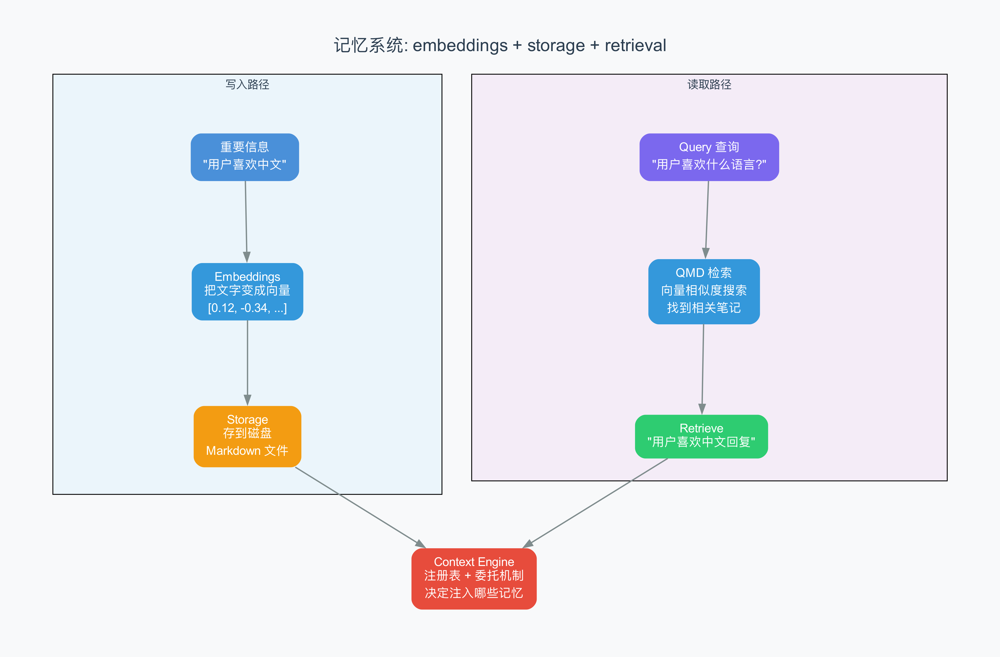

# 第 10 章 Context Engine 与记忆系统

> AI 的"大脑"里有一块小黑板，Context Engine 决定什么写上去、什么擦掉、什么存进抽屉。

## 10.1 从上一章到这里

上一章我们聊了 Hook 系统——一套自动化的"流水线"，让消息在处理过程中可以被拦截、修改、扩展。Hook 是手脚，负责干活；但干活之前，AI 得先"记住"该干什么、之前聊过什么。

这就是 Context Engine（上下文引擎）的活了。

如果 Hook 是工厂里的传送带，Context Engine 就是工厂旁边的仓库管理员。传送带只管把零件从一个工位送到下一个工位，但仓库管理员要决定：哪些原料放在手边（随取随用），哪些收进冷库（需要时再翻），哪些过期的直接扔掉。没有仓库管理员，传送带上堆满零件，工厂就瘫痪了。

OpenClaw 的 Context Engine 就是这个仓库管理员。它管理 AI 的"短期记忆"和"长期记忆"，确保 AI 在有限的脑袋空间里，始终装着最有用的信息。

## 10.2 为什么需要 Context Engine

还记得第 2 章提到的"虚拟内存"概念吗？现在我们把它变成现实。

AI 模型有一个硬性限制：**Context Window（上下文窗口）**。你可以把它想象成 AI 的"工作台"——同时能摊开多少张纸。GPT-4 的上下文窗口大约是 128K tokens（token 是 AI 处理文字的基本单位，约等于 3/4 个英文单词），Claude 3.5 大约是 200K tokens。

200K tokens 听起来很多，实际上大约就是 15 万字——一本中等长度的小说。但问题是：**用户的对话是没有上限的**。有人可能和 AI 聊一整天，有人可能让 AI 处理几百页的文档。对话历史会越来越长，迟早会超过上下文窗口。

这就像你和一个朋友聊天，聊了三个小时后，你不可能把每一句话都记在脑子里。你会自然地做三件事：

1. **总结**：把前面的对话压缩成"之前我们讨论了去哪里旅游，你推荐了日本"
2. **遗忘**：无关紧要的细节（比如"你刚才喝了一口水"）直接丢掉
3. **记笔记**：重要的信息（比如"我的航班号是 CA123"）写下来，需要时翻笔记本

Context Engine 就是让 AI 也能做这三件事的系统。用技术语言说，它有四个核心操作：

- **Assemble（组装）**：在每次 AI 调用前，把最相关的信息组装成上下文
- **Compact（压缩）**：对话太长时，把旧对话压缩成摘要
- **Ingest（摄入）**：把重要信息写入持久化存储（长期记忆）
- **Maintain（维护）**：定期清理过期和无用的数据

## 10.3 Context Engine 架构

OpenClaw 把 Context Engine 做成了一个可插拔的模块。就像你可以给电脑换不同的硬盘，你也可以给 OpenClaw 换不同的"记忆系统"。



从 `src/context-engine/` 目录可以看到核心源码结构：

```
src/context-engine/
├── index.ts        # 对外导出的 API
├── registry.ts     # 工厂注册表
├── types.ts        # 类型定义（接口）
├── delegate.ts     # 压缩委托
└── legacy.ts       # 旧版兼容
```

### 注册表模式

`registry.ts` 实现了一个经典的工厂注册表（Factory Registry）模式。所谓"工厂注册表"，就是一个登记簿——你想用哪种记忆系统，先到登记簿上注册，系统运行时按名字查找。

```typescript
// registry.ts 的核心思想
const registry = new Map<string, ContextEngineFactory>();

function registerContextEngine(name: string, factory: ContextEngineFactory) {
  registry.set(name, factory);  // 注册
}

function resolveContextEngine(name: string): ContextEngine {
  const factory = registry.get(name);  // 查找
  return factory?.() ?? new LegacyContextEngine();  // 找不到就用旧版
}
```

这个模式的好处是：**松耦合**（loose coupling，即模块之间不直接依赖，通过注册表间接联系）。你想用向量数据库做记忆系统？注册一个。你想用简单的文件存储？注册另一个。Gateway 核心代码完全不需要改动。

### ContextEngine 接口

`types.ts` 定义了 Context Engine 的接口（interface，即规定"必须实现哪些方法"的契约）：

```typescript
type ContextEngine = {
  assemble(context): Promise<AssembleResult>;    // 组装上下文
  compact(context): Promise<CompactResult>;       // 压缩对话
  ingest(context): Promise<IngestResult>;          // 写入长期记忆
  maintain(context): Promise<MaintenanceResult>;   // 维护清理
};
```

这四个方法正好对应前面说的四个操作。用餐厅的比喻：

| 方法 | 餐厅比喻 | 做什么 |
|------|----------|--------|
| `assemble` | 出餐前检查订单 | 把当前订单、顾客偏好、菜品做法组装在一起 |
| `compact` | 打烊时整理订单 | 把一天的订单汇总成日报，丢掉零碎的单据 |
| `ingest` | 记录常客偏好 | 把"张先生不吃辣"写进常客本 |
| `maintain` | 定期清理过期食材 | 扔掉过期食材，更新库存 |

### LegacyContextEngine

`legacy.ts` 提供了旧版兼容的 Context Engine。当系统找不到任何注册的记忆引擎时，就回退到这个最基本的版本。它就像餐厅没有电脑系统时的"纸笔记录"——虽然简陋，但保证系统不会因为缺少记忆模块而崩溃。

## 10.4 Memory Host SDK

注册表模式只是"外壳"，真正干活的"内核"在 `packages/memory-host-sdk/` 里。这是一个独立的包（package，即可复用的代码模块），专门负责记忆的存储和检索。

从源码结构看：

```
packages/memory-host-sdk/src/
├── engine.ts              # 主引擎入口
├── engine-embeddings.ts   # 向量嵌入（文字 → 数字）
├── engine-qmd.ts          # QMD 查询引擎
├── engine-storage.ts      # 存储层（SQLite）
└── engine-foundation.ts   # 基础工具
```

这五个文件构成了一条完整的记忆处理流水线：

```
engine-embeddings.ts → 把文字变成数字向量
         ↓
engine-qmd.ts       → 根据向量查找相关记忆
         ↓
engine-storage.ts   → 把数据存进 SQLite 数据库
         ↓
engine-foundation.ts → 提供共享的基础工具函数
         ↓
engine.ts           → 把上面所有功能组合在一起
```

### 向量嵌入：文字变数字

`engine-embeddings.ts` 做的事情听起来像魔法：**把一段文字变成一串数字**。这个过程叫 Embedding（嵌入），得到的那串数字叫向量（vector）。

为什么要变数字？因为计算机不懂"意思"，但懂"距离"。两段意思相近的文字，变成向量后在数学空间里会离得很近；意思不同的文字，向量距离就远。

举个例子：

| 文字 | 向量（简化） |
|------|-------------|
| "我喜欢吃苹果" | [0.8, 0.2, 0.9, ...] |
| "我爱吃水果" | [0.7, 0.3, 0.8, ...] |
| "今天股市大跌" | [0.1, 0.9, 0.1, ...] |

前两句话的向量很接近（都喜欢、都和食物有关），第三句话的向量离它们很远。这样，当 AI 想找"用户喜欢吃什么"的记忆时，只需要把查询也变成向量，然后找距离最近的那些就行。

### QMD 查询引擎

`engine-qmd.ts` 实现了 QMD（Query-Match-Document，查询-匹配-文档）引擎。它的工作方式是：

1. **Query（查询）**：把用户的当前问题变成向量
2. **Match（匹配）**：在数据库中找到向量距离最近的文档
3. **Document（文档）**：返回匹配到的文档内容

这就是为什么 AI 能"想起来"几天前你说过的话——不是因为 AI 真的"记住"了，而是因为系统把你说过的话变成了向量存起来，现在用向量距离找到了它。

### 存储层

`engine-storage.ts` 使用 SQLite（一种轻量级的关系型数据库，不需要独立服务器，数据存在单个文件中）作为存储后端。选择 SQLite 有几个好处：

- **零配置**：不需要安装数据库服务器
- **单文件**：整个数据库就是一个 `.db` 文件，方便备份和迁移
- **足够快**：对于记忆检索这种读多写少的场景，SQLite 的性能绰绰有余

## 10.5 记忆写入路径

现在让我们跟踪一条记忆从"诞生"到"落库"的完整路径。

**场景**：用户说"我的航班号是 CA123，明天上午 10 点起飞"。

```
用户消息 → AI 判断重要 → 调用 ingest() → 文字向量化 → 存入 SQLite
```

详细步骤：

**第一步：AI 判断是否需要记忆**

不是每句话都需要记住。"今天天气不错"不值得记，"我的航班号是 CA123"值得记。AI 会根据对话内容自行决定。

**第二步：调用 ingest 方法**

Context Engine 的 `ingest` 方法被调用，传入需要记忆的文本内容。

**第三步：向量化（Embedding）**

`engine-embeddings.ts` 把文本"用户的航班号是 CA123，明天上午 10 点起飞"发送给嵌入模型（Embedding Model，专门把文字变成向量的 AI 模型），得到一串几百维的数字向量。

**第四步：存入数据库**

`engine-storage.ts` 把原始文本和对应的向量一起存入 SQLite。数据库表大致是这样的：

| id | text | vector | timestamp | session_key |
|----|------|--------|-----------|-------------|
| 42 | 用户的航班号是 CA123... | [0.12, 0.87, ...] | 1712345678 | user_123 |

整个过程就像你在餐厅和老板聊天，说到"我对花生过敏"，老板在常客本上记一笔。只不过 OpenClaw 不是用笔和纸，而是用向量化和 SQLite。

## 10.6 记忆读取路径

写入的反面就是读取。当 AI 需要回忆什么时：

**场景**：用户问"我明天几点出发？"

```
用户问题 → 向量化 → 在数据库中搜索最近向量 → 返回匹配文档 → AI 组织回答
```

**第一步：查询向量化**

把"我明天几点出发？"变成向量。

**第二步：向量检索（Vector Search）**

在 SQLite 中查找与查询向量最近的那些记忆。衡量"近"的方法通常是余弦相似度（Cosine Similarity，一种衡量两个向量方向是否一致的方法，值域从 -1 到 1，越接近 1 越相似）。

**第三步：返回匹配结果**

找到"用户的航班号是 CA123，明天上午 10 点起飞"这条记忆。

**第四步：注入上下文**

`assemble` 方法把找到的记忆注入到 AI 的上下文中，AI 就能回答"您明天上午 10 点起飞，航班号 CA123"。

这个过程的精妙之处在于：AI 不是在"翻聊天记录"，而是在"查找语义相似的内容"。哪怕你问的方式完全不同（比如"我的飞机啥时候飞"），只要意思相近，向量距离就近，就能找到。

## 10.7 压缩机制

对话越来越长，上下文窗口装不下了，怎么办？压缩（Compact）。

`delegate.ts` 文件中有一个关键函数 `delegateCompactionToRuntime`——它把压缩的工作委托（delegate，即交给别人去做）给运行时引擎。这就像餐厅经理把"整理旧订单"的工作交给夜班工人——白天忙着做菜没空整理，晚上闲下来再处理。

压缩过程分为四个步骤：

### 步骤一：冲刷重要信息（Flush Before Compact）

在压缩之前，先把上下文中可能丢失的重要信息写入长期存储。这就像在打扫房间之前，先把桌上的重要文件收进保险柜——万一打扫时弄丢了也不怕。

### 步骤二：生成长对话摘要

AI 被要求阅读整个对话历史，生成一段简洁的摘要。比如 50 句话的对话，可能被压缩成 3 句话：

> 用户询问了日本旅游攻略。讨论了东京和大阪的行程安排。用户偏好美食和历史文化景点。

### 步骤三：替换历史

把详细的对话历史从上下文窗口中移除，换成简短的摘要。

### 步骤四：保留近期消息

摘要 + 最近几轮对话一起组成新的上下文。这样 AI 既知道"大方向"（摘要），又能看到"最近聊了什么"（近期消息）。

用一张表格说明压缩前后的对比：

| | 压缩前 | 压缩后 |
|---|--------|--------|
| System Prompt | 保留 | 保留 |
| 对话摘要 | 无 | 新增（3-5 句话） |
| 完整对话历史 | 50 句话（可能超限） | 最近 10 句话 |
| 长期记忆 | 无变化 | 新增了重要信息 |

压缩机制确保了 AI 的"工作台"永远不会溢出。旧的、不重要的信息被压缩成摘要，重要的信息被存入长期记忆，最近的消息保持原样——三者结合，让 AI 在有限的上下文窗口里发挥最大的记忆能力。

## 10.8 小结

这章我们深入了 OpenClaw 的"大脑记忆系统"——Context Engine：

1. **为什么需要它**：AI 的上下文窗口有限，对话无限增长，需要一套系统来管理什么留下、什么丢弃
2. **可插拔架构**：通过工厂注册表模式，可以灵活切换不同的记忆引擎
3. **四个核心操作**：组装（assemble）、压缩（compact）、摄入（ingest）、维护（maintain）
4. **向量嵌入**：把文字变成数字，用数学距离衡量语义相似性
5. **QMD 查询**：通过向量检索实现"语义记忆"而非"精确匹配"
6. **压缩流程**：先冲刷重要信息，再生成摘要，最后替换历史

Context Engine 让 AI 不再是"金鱼记忆"——它能记住三天前你说过的话，也能在聊了一整天后仍然保持清醒。下一章，我们将转向系统的另一个关键维度：安全与审计——毕竟，一个能记住一切的 AI，如果不够安全，后果同样严重。

---

## 术语速查表

| 术语 | 解释 |
|------|------|
| Assemble | 组装，在 AI 调用前把最相关的信息组合成上下文 |
| Compact | 压缩，把长对话历史总结为简短摘要 |
| Context Engine | 上下文引擎，管理 AI 记忆的核心模块 |
| Context Window | 上下文窗口，AI 一次能处理的最大文字量 |
| Cosine Similarity | 余弦相似度，衡量两个向量方向一致性的方法 |
| Delegate | 委托，把任务交给另一个模块处理 |
| Embedding | 嵌入，把文字转化为数字向量的过程 |
| Factory Registry | 工厂注册表，按名字查找和创建对象的模式 |
| Ingest | 摄入，把重要信息写入持久化存储 |
| Interface | 接口，规定必须实现哪些方法的契约 |
| Legacy | 旧版兼容，保证旧系统能继续运行的兼容层 |
| Loose Coupling | 松耦合，模块之间不直接依赖，通过间接方式联系 |
| Maintain | 维护，定期清理过期和无用的数据 |
| Package | 包，可复用的独立代码模块 |
| QMD | Query-Match-Document，查询-匹配-文档的检索模式 |
| SQLite | 轻量级数据库，数据存储在单个文件中，无需独立服务器 |
| Token | AI 处理文字的基本单位，约等于 3/4 个英文单词 |
| Vector | 向量，一组有序的数字，用于表示文字的数学特征 |
| Vector Search | 向量检索，通过数学距离查找相似内容的方法 |
