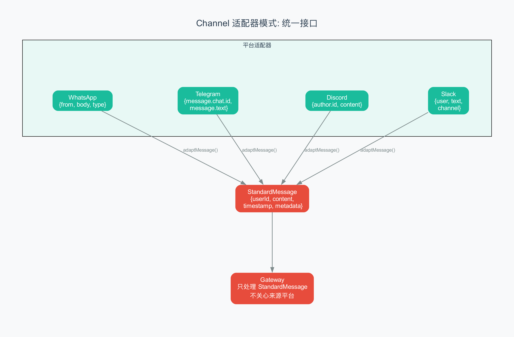

# 第 12 章 用 TypeScript 实现最小 Gateway

> 500 行代码，搭起一座连接多渠道的"分拣中心"。

## 12.1 从上一章到这里

前 11 章我们一直在"读"代码——看 OpenClaw 的架构、看源码、看设计理念。但光看不练假把式。这章，我们要把前面学到的知识综合起来，亲手"写"一个最小的多渠道 Gateway。

别担心，不会很复杂。我们的目标是约 500 行 TypeScript 代码，实现一个能跑的、能同时处理多个消息渠道的网关。它会演示 OpenClaw 的三层架构（Gateway + Channel + LLM），但砍掉了生产环境中的各种"铠甲"（错误重试、安全过滤、审计日志……这些你在前几章已经看过了）。

这是本章要实现的架构：

```
用户 A (WhatsApp) ──→ ┐
                       ├──→ Gateway ──→ LLM ──→ AI 回复 ──→ 用户
用户 B (Telegram) ──→ ┘
```

一个 Gateway，两个 Channel，一个 AI 模型，实时流式响应。

准备好了吗？让我们开始。

## 12.2 设计目标

在写代码之前，先明确我们要实现什么：

1. **三层架构**：Gateway（网关）+ Channel（渠道适配器）+ LLM（大语言模型调用）
2. **WebSocket 服务**：浏览器可以实时连接，看到 AI 的流式输出
3. **消息路由**：不同渠道的消息统一处理，回复时路由回正确的渠道
4. **流式传输**：AI 的回复一个字一个字地推送到客户端（150ms 节流，还记得第 5 章吗？）
5. **会话管理**：每个用户有独立的对话历史

**不是目标**（为了简洁而砍掉的）：
- 安全过滤和审计日志（第 7/11 章已讲）
- 错误重试和容错（生产级功能）
- 配置热重载（第 5 章已讲）
- Context Engine 记忆系统（第 10 章已讲）



确保你的环境有 Node.js（建议 18+）和 TypeScript。创建一个新目录，初始化项目：

```bash
mkdir minimal-gateway && cd minimal-gateway
npm init -y
npm install ws typescript @types/node @types/ws --save-dev
npx tsc --init
```

## 12.3 第一步：核心类型定义

一切从类型开始。TypeScript 的类型系统就像蓝图——先把数据结构定义清楚，后面写代码才有方向。

创建 `types.ts`：

```typescript
// types.ts — 整个 Gateway 的数据蓝图

// 统一消息格式：无论消息来自 WhatsApp 还是 Telegram，
// 在 Gateway 内部都长这个样子
interface StandardMessage {
  userId: string;          // 谁发的
  content: string;         // 消息内容
  timestamp: number;       // 发送时间（毫秒时间戳）
  metadata: {              // 附加信息
    platform: string;      // 来自哪个平台
    [key: string]: unknown; // 其他平台特有的字段
  };
}

// 会话（Session）：一个用户的完整对话状态
// 就像餐厅里的一张桌子——客人来了分配一张，
// 菜单（历史消息）都放在桌上
interface Session {
  key: string;             // 会话唯一标识（userId + platform）
  history: Array<{         // 对话历史
    role: 'user' | 'assistant';
    content: string;
  }>;
  lastActivity: number;    // 最后活跃时间（用于清理过期会话）
}

// 流式事件（Stream Event）：AI 回复时推送的三种事件
// 对应第 5 章讲的三种事件流
type StreamEvent =
  | { stream: 'assistant'; data: { text: string; delta: string } }
  | { stream: 'tool'; data: { phase: string; name: string } }
  | { stream: 'lifecycle'; data: { phase: string } };

// 导出所有类型
export { StandardMessage, Session, StreamEvent };
```

注意三个设计选择：

1. **StandardMessage** 统一了不同平台的消息格式。WhatsApp 发来的消息可能有 `from` 和 `body` 字段，Telegram 可能有 `message.from.id` 和 `message.text` 字段——但在 Gateway 内部，它们都是 `StandardMessage`。这就是第 3 章讲的"渠道适配器"模式。

2. **Session** 只保存必要信息：会话 ID、对话历史、最后活跃时间。没有用户密码、没有权限信息——最小化设计。

3. **StreamEvent** 用 TypeScript 的联合类型（Union Type）定义了三种互斥的事件类型。每个事件都有 `stream` 字段用于区分类型，这是经典的"可辨识联合"（Discriminated Union）模式。

## 12.4 第二步：Channel 适配器

Channel 适配器（Channel Adapter）是把不同消息平台的"方言"翻译成 Gateway 能懂的"普通话"的翻译器。

创建 `channel.ts`：

```typescript
// channel.ts — 渠道适配器

import { StandardMessage } from './types';

// 适配器接口：所有渠道必须实现这三个方法
interface ChannelAdapter {
  name: string;                                    // 渠道名称
  normalizeMessage(raw: unknown): StandardMessage;  // 翻译成统一格式
  sendMessage(userId: string, text: string): Promise<void>; // 发送回复
}

// WhatsApp 适配器（模拟）
class WhatsAppAdapter implements ChannelAdapter {
  name = 'whatsapp';

  // WhatsApp Webhook 发来的原始格式（简化）
  normalizeMessage(raw: any): StandardMessage {
    return {
      userId: raw.from ?? 'unknown',
      content: raw.body ?? '',
      timestamp: Date.now(),
      metadata: {
        platform: 'whatsapp',
        messageId: raw.messageId,
        profileName: raw.profileName,
      },
    };
  }

  // 发送回复给 WhatsApp 用户
  async sendMessage(userId: string, text: string): Promise<void> {
    console.log(`[WhatsApp → ${userId}]: ${text}`);
    // 实际项目中，这里调用 WhatsApp Business API
    // 这里用 console.log 模拟
  }
}

// Telegram 适配器（模拟）
class TelegramAdapter implements ChannelAdapter {
  name = 'telegram';

  // Telegram Bot API 发来的原始格式（简化）
  normalizeMessage(raw: any): StandardMessage {
    return {
      userId: String(raw.message?.from?.id ?? 'unknown'),
      content: raw.message?.text ?? '',
      timestamp: Date.now(),
      metadata: {
        platform: 'telegram',
        chatId: raw.message?.chat?.id,
        firstName: raw.message?.from?.first_name,
      },
    };
  }

  // 发送回复给 Telegram 用户
  async sendMessage(userId: string, text: string): Promise<void> {
    console.log(`[Telegram → ${userId}]: ${text}`);
    // 实际项目中，这里调用 Telegram Bot API
  }
}

// 导出一个控制台适配器，方便测试
class ConsoleAdapter implements ChannelAdapter {
  name = 'console';

  normalizeMessage(raw: any): StandardMessage {
    return {
      userId: raw.userId ?? 'console-user',
      content: raw.content ?? '',
      timestamp: Date.now(),
      metadata: { platform: 'console' },
    };
  }

  async sendMessage(userId: string, text: string): Promise<void> {
    console.log(`[AI → ${userId}]: ${text}`);
  }
}

export { ChannelAdapter, WhatsAppAdapter, TelegramAdapter, ConsoleAdapter };
```

这里的关键设计是 **ChannelAdapter 接口**。它规定了三个必须实现的方法，任何新渠道只要实现了这三个方法，就能无缝接入 Gateway。想加 Discord？写一个 `DiscordAdapter`。想加 Slack？写一个 `SlackAdapter`。Gateway 核心代码完全不用改。

这就是第 3 章讲的"开闭原则"（Open-Closed Principle）——对扩展开放，对修改关闭。

## 12.5 第三步：Session Store

会话存储（Session Store）管理所有用户的对话状态。它就像餐厅的桌子管理系统——记录每张桌子对应哪位客人、桌上放了什么。

创建 `session-store.ts`：

```typescript
// session-store.ts — 会话状态管理

import { Session } from './types';

class SessionStore {
  // 用 Map 存储所有会话，key 是 "platform:userId"
  private sessions = new Map<string, Session>();

  // 获取已有会话，或创建新会话
  getOrCreate(key: string): Session {
    let session = this.sessions.get(key);
    if (!session) {
      session = {
        key,
        history: [],
        lastActivity: Date.now(),
      };
      this.sessions.set(key, session);
      console.log(`[Session] 创建新会话: ${key}`);
    }
    session.lastActivity = Date.now();
    return session;
  }

  // 往会话中添加一条消息
  addMessage(key: string, role: 'user' | 'assistant', content: string): void {
    const session = this.getOrCreate(key);
    session.history.push({ role, content });
    // 限制历史长度，防止内存溢出
    if (session.history.length > 100) {
      session.history = session.history.slice(-80); // 保留最近 80 条
    }
  }

  // 清理过期会话（超过 maxAge 毫秒没有活动的）
  prune(maxAge: number): void {
    const now = Date.now();
    let removed = 0;
    for (const [key, session] of this.sessions) {
      if (now - session.lastActivity > maxAge) {
        this.sessions.delete(key);
        removed++;
      }
    }
    if (removed > 0) {
      console.log(`[Session] 清理了 ${removed} 个过期会话`);
    }
  }

  // 获取当前活跃会话数
  get size(): number {
    return this.sessions.size;
  }
}

export { SessionStore };
```

有两个值得注意的细节：

**历史长度限制**：`addMessage` 中，当历史超过 100 条时，砍掉最早的 20 条，只保留最近 80 条。这是第 10 章讲的"压缩"的极简版本——生产环境中会用 Context Engine 做更智能的压缩，但我们这里用最简单的"滑动窗口"（Sliding Window，只保留最近 N 条记录的策略）。

**定期清理**：`prune` 方法清理超过指定时间没有活动的会话。在 `main.ts` 中我们会设置一个定时器，每 5 分钟调用一次。

## 12.6 第四步：Gateway 核心

这是最核心的部分。Gateway 把 Channel 适配器、Session 存储、LLM 调用、WebSocket 服务全部串联起来。

创建 `gateway.ts`：

```typescript
// gateway.ts — Gateway 核心

import { WebSocket, WebSocketServer } from 'ws';
import { StandardMessage, StreamEvent } from './types';
import { ChannelAdapter } from './channel';
import { SessionStore } from './session-store';
import { ChatStreamer } from './streamer';

class Gateway {
  private sessions: SessionStore;
  private channels: Map<string, ChannelAdapter>;
  private wss: WebSocketServer | null = null;
  private streamer: ChatStreamer;
  private clients = new Map<string, WebSocket>();  // WebSocket 客户端

  constructor() {
    this.sessions = new SessionStore();
    this.channels = new Map();
    this.streamer = new ChatStreamer();
  }

  // 注册渠道适配器
  registerChannel(adapter: ChannelAdapter): void {
    this.channels.set(adapter.name, adapter);
    console.log(`[Gateway] 注册渠道: ${adapter.name}`);
  }

  // 启动 WebSocket 服务
  start(port: number): void {
    this.wss = new WebSocketServer({ port });

    this.wss.on('connection', (ws) => {
      const clientId = `ws-${Date.now()}`;
      this.clients.set(clientId, ws);
      console.log(`[WebSocket] 新连接: ${clientId} (共 ${this.clients.size} 个)`);

      // 接收客户端消息（模拟从各渠道发来的消息）
      ws.on('message', async (data) => {
        try {
          const raw = JSON.parse(data.toString());
          const channel = this.channels.get(raw.channel ?? 'console');
          if (!channel) {
            ws.send(JSON.stringify({ error: '未知渠道' }));
            return;
          }
          await this.handleMessage(channel.name, raw);
        } catch (err) {
          ws.send(JSON.stringify({ error: '消息格式错误' }));
        }
      });

      ws.on('close', () => {
        this.clients.delete(clientId);
        this.streamer.removeClient(clientId);
        console.log(`[WebSocket] 断开: ${clientId}`);
      });
    });

    // 定期清理过期会话（每 5 分钟）
    setInterval(() => this.sessions.prune(30 * 60 * 1000), 5 * 60 * 1000);

    console.log(`[Gateway] 启动成功，监听端口 ${port}`);
  }

  // 处理一条消息的完整流程
  async handleMessage(channelName: string, raw: unknown): Promise<void> {
    const channel = this.channels.get(channelName);
    if (!channel) return;

    // 1. 标准化消息
    const message: StandardMessage = channel.normalizeMessage(raw);
    if (!message.content) return;  // 空消息忽略

    const sessionKey = `${channelName}:${message.userId}`;
    console.log(`[Gateway] 收到消息 [${sessionKey}]: ${message.content}`);

    // 2. 存入会话历史
    this.sessions.addMessage(sessionKey, 'user', message.content);

    // 3. 发送 lifecycle:start 事件
    this.broadcast({ stream: 'lifecycle', data: { phase: 'start' } });

    // 4. 调用 LLM（模拟流式响应）
    const session = this.sessions.getOrCreate(sessionKey);
    const fullResponse = await this.callLLMStream(sessionKey, session.history);

    // 5. 存入会话历史
    this.sessions.addMessage(sessionKey, 'assistant', fullResponse);

    // 6. 通过渠道发送回复
    await channel.sendMessage(message.userId, fullResponse);

    // 7. 发送 lifecycle:end 事件
    this.broadcast({ stream: 'lifecycle', data: { phase: 'end' } });
  }

  // 模拟 LLM 的流式调用
  private async callLLMStream(sessionKey: string, history: any[]): Promise<string> {
    // 在真实的 OpenClaw 中，这里会调用 Claude/GPT API
    // 我们模拟一个 AI 逐字生成回复的过程
    const lastUserMsg = history.filter(m => m.role === 'user').pop();
    const userText = lastUserMsg?.content ?? '';

    // 模拟 AI 回复
    const reply = `你好！你说了："${userText}"。` +
      `我是最小 Gateway 的模拟 AI。` +
      `你的会话 ID 是 ${sessionKey}，` +
      `当前有 ${this.sessions.size} 个活跃会话。`;

    // 模拟逐字输出
    let fullText = '';
    for (const char of reply) {
      fullText += char;
      const delta = char;

      // 通过 streamer 推送（150ms 节流）
      for (const [clientId] of this.clients) {
        this.streamer.push(clientId, fullText, delta);
      }

      // 模拟 AI 的输出速度（每个字 30-80ms）
      await new Promise(r => setTimeout(r, 30 + Math.random() * 50));
    }

    // 最终冲刷
    for (const [clientId] of this.clients) {
      this.streamer.flush(clientId, (id, text) => {
        const ws = this.clients.get(id);
        if (ws && ws.readyState === WebSocket.OPEN) {
          ws.send(JSON.stringify({
            stream: 'assistant',
            data: { text, delta: '' },
          }));
        }
      });
    }

    return reply;
  }

  // 广播事件给所有 WebSocket 客户端
  private broadcast(event: StreamEvent): void {
    const data = JSON.stringify(event);
    for (const ws of this.clients.values()) {
      if (ws.readyState === WebSocket.OPEN) {
        ws.send(data);
      }
    }
  }
}

export { Gateway };
```

注意 `handleMessage` 方法的七步流程——这和第 5 章讲的 Gateway 处理流程几乎一模一样：

1. 标准化消息（Channel 适配器翻译）
2. 存入会话历史
3. 通知 lifecycle:start
4. 调用 LLM（流式）
5. 存入 AI 回复
6. 通过渠道发送回复
7. 通知 lifecycle:end

唯一的区别是我们用模拟代替了真实的 LLM API 调用。在真实项目中，`callLLMStream` 里的代码会替换成对 Claude 或 GPT API 的流式调用。

## 12.7 第五步：流式传输

这是第 5 章的"delta → buffer → 150ms 节流 → broadcast"的简化实现。

创建 `streamer.ts`：

```typescript
// streamer.ts — 150ms 节流的流式传输器

class ChatStreamer {
  // 每个客户端的文本缓冲区
  private buffers = new Map<string, string>();
  // 每个客户端的上次发送时间
  private lastSent = new Map<string, number>();
  // 节流间隔（毫秒）
  private throttleMs = 150;

  // 推送一段新文本
  push(clientId: string, fullText: string, delta: string): void {
    // 追加到缓冲区
    const buffer = (this.buffers.get(clientId) ?? '') + delta;
    this.buffers.set(clientId, buffer);

    const now = Date.now();
    const last = this.lastSent.get(clientId) ?? 0;

    // 距离上次发送是否超过 150ms？
    if (now - last >= this.throttleMs) {
      this.sendToClient(clientId, fullText);
      this.lastSent.set(clientId, now);
      this.buffers.set(clientId, '');  // 清空缓冲区
    }
    // 如果不到 150ms，什么都不做——文本留在缓冲区等下次
  }

  // 最终冲刷：AI 回复结束后，把缓冲区剩余内容全部发出去
  flush(clientId: string, sender: (id: string, text: string) => void): void {
    const buffer = this.buffers.get(clientId);
    if (buffer && buffer.length > 0) {
      sender(clientId, buffer);
      this.buffers.set(clientId, '');
    }
    // 清理状态
    this.buffers.delete(clientId);
    this.lastSent.delete(clientId);
  }

  // 移除客户端（断开连接时调用）
  removeClient(clientId: string): void {
    this.buffers.delete(clientId);
    this.lastSent.delete(clientId);
  }

  // 发送文本给客户端（在这里触发实际的 WebSocket 发送）
  private sendToClient(clientId: string, text: string): void {
    // 这个方法会被 Gateway 接管，
    // 因为只有 Gateway 知道怎么发送 WebSocket 消息
  }
}

export { ChatStreamer };
```

150ms 节流的核心逻辑就在这里。对比第 5 章看到的 OpenClaw 源码：

```typescript
// OpenClaw 的节流逻辑（第 5 章原文）
const now = Date.now();
const last = chatRunState.deltaSentAt.get(clientRunId) ?? 0;
if (now - last < 150) {
  return;  // 不到 150ms，跳过
}
chatRunState.deltaSentAt.set(clientRunId, now);
```

我们的实现和 OpenClaw 的思路完全一致：记录上次发送时间，如果不到 150ms 就攒着，到了就一次性发送缓冲区里的全部内容。区别只在于 OpenClaw 用的是 `Map<clientRunId, timestamp>`，我们用的是 `Map<clientId, timestamp>`——本质一样。

## 12.8 第六步：启动与路由

最后，把所有零件组装起来。创建 `main.ts`：

```typescript
// main.ts — 启动入口

import { Gateway } from './gateway';
import { WhatsAppAdapter, TelegramAdapter, ConsoleAdapter } from './channel';

// 创建 Gateway 实例
const gateway = new Gateway();

// 注册渠道适配器
gateway.registerChannel(new WhatsAppAdapter());
gateway.registerChannel(new TelegramAdapter());
gateway.registerChannel(new ConsoleAdapter());

// 启动 WebSocket 服务
const PORT = 3000;
gateway.start(PORT);

// ===== 测试：模拟消息进入 =====

// 等 1 秒让服务器完全启动
setTimeout(async () => {
  console.log('\n--- 模拟测试开始 ---\n');

  // 模拟一条 WhatsApp 消息
  await gateway.handleMessage('whatsapp', {
    from: '+8613800138000',
    body: '你好，帮我查一下明天的天气',
    messageId: 'msg_001',
  });

  console.log('');

  // 模拟一条 Telegram 消息
  await gateway.handleMessage('telegram', {
    message: {
      from: { id: 12345, first_name: '小明' },
      chat: { id: 12345 },
      text: '帮我写一首关于春天的诗',
    },
  });

  console.log('');

  // 模拟第二条 WhatsApp 消息（同一个用户，测试会话历史）
  await gateway.handleMessage('whatsapp', {
    from: '+8613800138000',
    body: '刚才我问的什么？',
    messageId: 'msg_002',
  });

  console.log('\n--- 模拟测试结束 ---\n');
  console.log('Gateway 仍在运行，可用 wscat 连接测试：');
  console.log('  npx wscat -c ws://localhost:3000');
  console.log('  发送: {"channel":"console","userId":"test","content":"你好"}');
}, 1000);
```

这个入口文件做了三件事：

1. **创建 Gateway**：实例化核心对象
2. **注册渠道**：把 WhatsApp、Telegram、Console 三个适配器注册进去
3. **模拟测试**：启动 1 秒后，模拟两条来自不同渠道的消息，验证整个流程

## 12.9 运行效果

把所有文件放在一起，目录结构应该是这样的：

```
minimal-gateway/
├── main.ts           # 启动入口
├── gateway.ts        # Gateway 核心
├── channel.ts        # 渠道适配器
├── session-store.ts  # 会话存储
├── streamer.ts       # 流式传输器
├── types.ts          # 类型定义
├── package.json
└── tsconfig.json
```

编译并运行：

```bash
npx tsc && node main.js
```

你会看到类似这样的输出：

```
[Gateway] 注册渠道: whatsapp
[Gateway] 注册渠道: telegram
[Gateway] 注册渠道: console
[Gateway] 启动成功，监听端口 3000

--- 模拟测试开始 ---

[Gateway] 收到消息 [whatsapp:+8613800138000]: 你好，帮我查一下明天的天气
[Session] 创建新会话: whatsapp:+8613800138000
[WhatsApp → +8613800138000]: 你好！你说了："你好，帮我查一下明天的天气"。
我是最小 Gateway 的模拟 AI。你的会话 ID 是 whatsapp:+8613800138000，
当前有 1 个活跃会话。

[Gateway] 收到消息 [telegram:12345]: 帮我写一首关于春天的诗
[Session] 创建新会话: telegram:12345
[Telegram → 12345]: 你好！你说了："帮我写一首关于春天的诗"。
我是最小 Gateway 的模拟 AI。你的会话 ID 是 telegram:12345，
当前有 2 个活跃会话。

[Gateway] 收到消息 [whatsapp:+8613800138000]: 刚才我问的什么？
[WhatsApp → +8613800138000]: 你好！你说了："刚才我问的什么？"。
我是最小 Gateway 的模拟 AI。你的会话 ID 是 whatsapp:+8613800138000，
当前有 2 个活跃会话。

--- 模拟测试结束 ---

Gateway 仍在运行，可用 wscat 连接测试：
  npx wscat -c ws://localhost:3000
  发送: {"channel":"console","userId":"test","content":"你好"}
```

你也可以打开另一个终端，用 `wscat` 连接 WebSocket 服务器，实时看到 AI 的流式输出：

```bash
npx wscat -c ws://localhost:3000
# 发送: {"channel":"console","userId":"test","content":"你好世界"}
# 你会看到 AI 的回复一个字一个字地出现（150ms 节流）
```

### 发生了什么？

让我们跟踪一条消息的完整旅程：

```
用户发送 {"channel":"console","content":"你好"}
    ↓
Gateway.handleMessage() 被调用
    ↓
ConsoleAdapter.normalizeMessage() 翻译成 StandardMessage
    ↓
SessionStore.addMessage() 存入对话历史
    ↓
broadcast(lifecycle:start) 通知所有 WebSocket 客户端
    ↓
callLLMStream() 模拟 AI 逐字生成回复
    ↓ （每 150ms）
ChatStreamer 推送累积的文本给 WebSocket 客户端
    ↓
ConsoleAdapter.sendMessage() 发送完整回复
    ↓
broadcast(lifecycle:end) 通知所有 WebSocket 客户端
```

这条链路和第 2 章讲的"一次请求的完整旅程"几乎一模一样——只是我们用 500 行代码把它实现了出来。

## 12.10 小结

这章我们从零搭建了一个最小的多渠道 Gateway，用约 500 行 TypeScript 代码实现了 OpenClaw 的核心设计：

1. **渠道适配器模式**：通过 `ChannelAdapter` 接口，不同消息平台可以无缝接入，Gateway 核心不需要改动
2. **会话管理**：`SessionStore` 管理每个用户的独立对话状态，支持自动清理过期会话
3. **消息路由**：标准化消息格式后统一处理，回复时路由回正确的渠道
4. **流式传输**：`ChatStreamer` 实现了和 OpenClaw 一致的 150ms 节流策略
5. **WebSocket 实时通信**：浏览器或其他客户端可以实时看到 AI 的流式输出

这个最小 Gateway 像一个"骨架"——没有肌肉（安全系统）、没有皮肤（错误处理）、没有大脑（真正的 AI 调用），但骨架的形状和真正的 OpenClaw Gateway 是一样的。理解了这个骨架，再去看 OpenClaw 的完整源码，你会发现那些复杂的功能都是在骨架上逐步叠加的。

到此为止，我们完成了 OpenClaw 源码分析的旅程。从第 1 章的"OpenClaw 是什么"到这里，你已经理解了它的三层架构、System Prompt、Gateway 核心、事件流、技能系统、Hook 系统、Context Engine、安全机制，并且亲手搭建了一个可运行的最小 Gateway。接下来，就是在真实项目中运用这些知识的时刻了。

---

## 术语速查表

| 术语 | 解释 |
|------|------|
| Channel Adapter | 渠道适配器，把不同平台的消息格式翻译成统一格式的模块 |
| Discriminated Union | 可辨识联合，通过公共字段区分类型的 TypeScript 类型模式 |
| DM | Direct Message，私信，用户和 AI 的一对一对话 |
| Final Flush | 最终冲刷，AI 回复结束后发送缓冲区中所有剩余文本 |
| Interface | 接口，TypeScript 中定义对象必须具有哪些属性和方法的类型 |
| LLM | Large Language Model，大语言模型，如 Claude、GPT 等 AI 模型 |
| Session Store | 会话存储，管理所有用户对话状态的模块 |
| Sliding Window | 滑动窗口，只保留最近 N 条记录的策略 |
| StandardMessage | 统一消息格式，Gateway 内部使用的标准化消息结构 |
| Throttle | 节流，限制操作频率的机制，这里是 150ms 间隔 |
| Union Type | 联合类型，TypeScript 中一个值可以是多种类型之一的类型 |
| WebSocket | 双向实时通信协议，服务器可以主动推送消息给客户端 |
| wscat | 一个命令行 WebSocket 客户端工具，用于测试 WebSocket 服务 |
